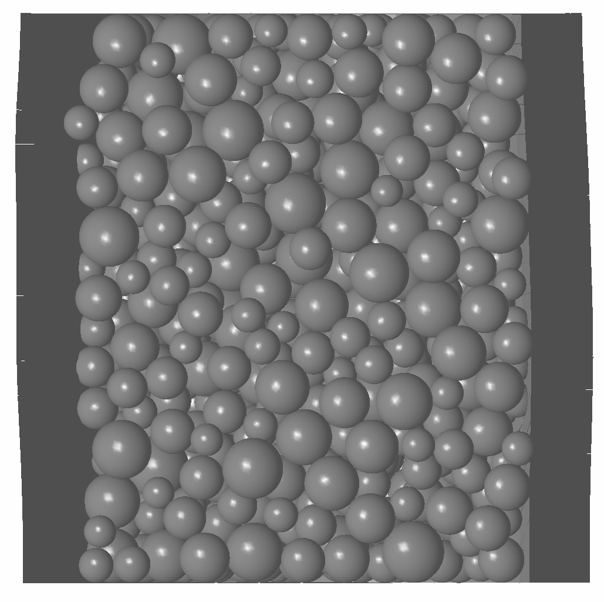
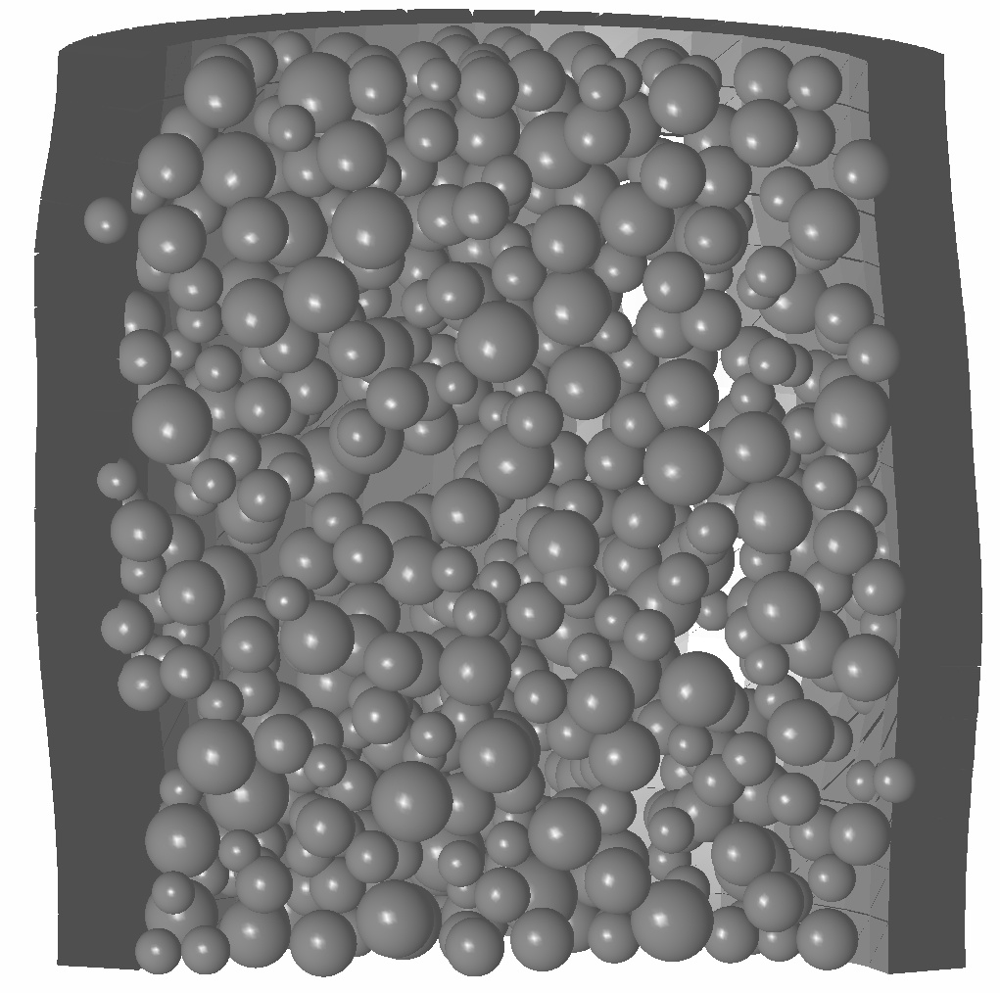
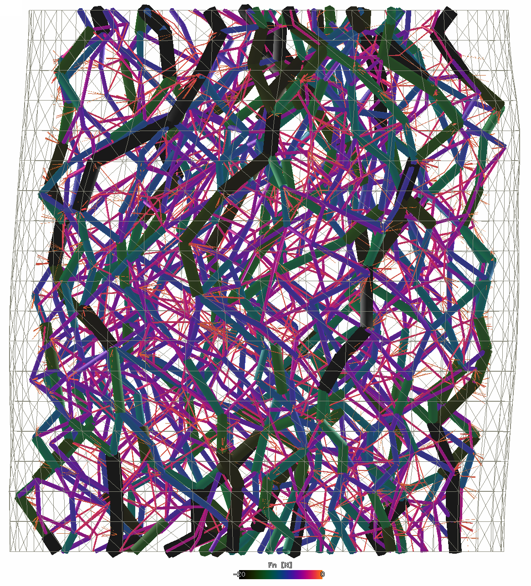
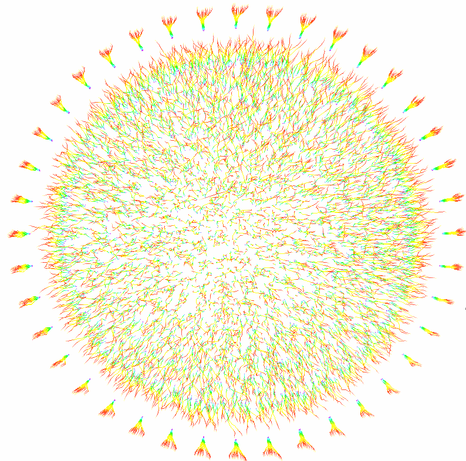
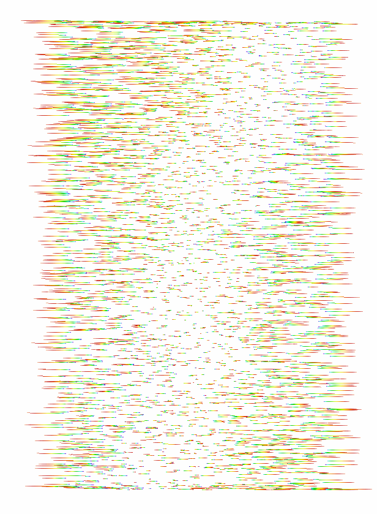
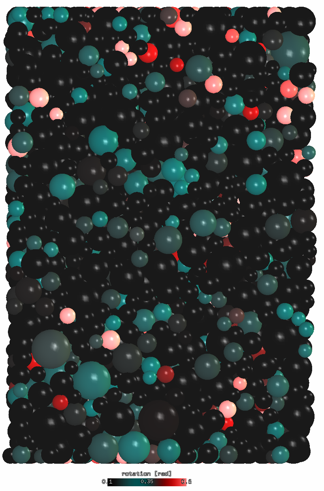

================================================
Cylindrical triaxial test with flexible membrane
================================================

Summary
--------
The task of this study was to investigate the **role of support friction in triaxial tests** using the discrete element method. Spherical grains and elastic membrane around the cylindrical specimen were used. Parametric study was performed varying specimen size, aspect ratio and support friction (normal or reduced values). The conclusion was that the role of support friction is in the same order of magnitude as scatter due to random factors in the simulation (such as particle arrangement), in contrast to laboratory experiments. A likely cause for this outcome is are spherical grains which do not have any rolling friction, unlike irregular shapes of real soils.

.. note:: The simulation presented here was done using the :obj:`woo.pre.cylTriax` preprocessor. Input data for the preprocessor will be added to Woo sources at some point, so that the results can be independently recalculated.

.. admonition:: Acknowledgement

   This project was supported by a commercial contract. We honor the wish to not disclose the identity of the contractor.
 
Setup
------
The simulation runs in coordinate system where :math:`z` is the axial direction, :math:`x` and :math:`y` are radial; average quantities, such as radial stress, are noted with the :math:`rr` index, as in :math:`\sigma_{rr}\equiv(\sigma_{xx}+\sigma_{yy})/2`.

The simulation runs in three distinct stages:

1. Compaction
   Non-overlapping spherical particles are generated in cylinder-shaped volume, of which radii satisfy the PSD (particle size distribution) function. Cylindrical volume, with rigid boundaries, is compressed to reach isotropic stress value :math:`\sigma_{\rm iso}`; friction parameters are set to zero to ensure high compacity of the resulting packing, as rearrangements are not constrained by tangential forces. Stresses are evaluated from global stress tensor :math:`\sigma` computed from contact forces. The controlling logic is independent for each axis and uses damped feedback loop :cite:`Modenese2013` to reach desired stress state :math:`\sigma_{rr}=\sigma_{zz}=\sigma_{\rm iso}`.

2. Membrane stabilization
   Rigid cylindrical boundary is made compliant (it is transformed into membrane), and each membrane element is loaded with surface load equal to :math:`\sigma_{\rm iso}`. Membrane surface load is adjusted so that :math:`\sigma_{rr}` reaches :math:`\sigma_{\rm iso}`, and :math:`\eps_{zz}` deformation is allowed to maintain :math:`\sigma_{zz}=\sigma_{\rm iso}`. Friction angle of particles/membrane/supports is incremented during this phase linearly to reach real levels used in the triaxial phase.

3. Triaxial phase
   The initial triaxial configuration is used as reference configuration with zero strain tensor. The value of :math:`\dot\eps_{zz}` is increased linearly to reach prescribed value, and axial compression continues until prescribed axial strain :math:`\eps_{zz}^{\rm max}` is attained. During this phase, volume enclosed by the membrane+supports triangulation is monitored. Besides axial strain :math:`\eps_{zz}=\log\frac{l_z}{l_{z0}}`, volumetric strain :math:`\eps_v=\log\frac{V}{V_0}` and stress tensor :math:`\sigma_{ii}`, we can compute mean and deviatoric stresses

   .. math::
      :nowrap:

         \begin{align}
            p&=\frac{1}{3}\tr\tens{\sigma}, & q&=\sigma_{zz}-\sigma_{rr}
         \end{align}

   and radial and deviatoric strain

   .. math::
      :nowrap:

      \begin{align}
         \eps_{rr}&=\frac{1}{2}(\eps_{v}-\eps_{zz}), & \eps_d=\eps_{zz}-\frac{2\eps_{rr}+\eps_{zz}}{3}. 
      \end{align}

   These are used to plot the :math:`q/p(\eps_d)` and :math:`\eps_v(\eps_d)` functions.

Input parameters
-----------------

Particle parameters were using usual values for stiffness and the :math:`k_T/k_N` ratio, with internal friction angle :math:`\tan\phi=0.4`. This value was valid for inter-particle contacts, and for particle-membrane contacts. Supports had the same parameters as particles (stiffness), but their friction was reduced in to 4° in some simulations. Dimensions of the cylinder had varying aspect ratios; number of particles was around 5000 for all simulations, with the exception of the 1:1A one, which had approximately 14.000 particles. Membrane parameters were taken roughly from :cite:`Molenkamp1981`.

Density of particles was scaled in order to establish quasi-static conditions with reasonable amount of computation :cite:`Thornton1998`.

All the parameters are shown in the following; quantities marked with "†" are scaled for the purposes of the simulation.

Membrane parameters
   =========================== ===== ===== =======================
   Young's modulus             1.1   MPa
   density †                   1×10⁸ kg/m³
   :math:`k_T/k_N`             0.2 
   friction angle :math:`\phi` 22    °     (:math:`\tan\phi=0.4`)
   thickness                   3     mm
   =========================== ===== ===== =======================

Particle parameters
   =========================== ===== ===== =======================
   Young's modulus              300  MPa 
   density †                   1×10⁸ kg/m³
   :math:`k_T/k_N`             0.2 
   friction angle :math:`\phi` 22    °     (:math:`\tan\phi=0.4`)
   diameter                    1−3   mm    (see PSD)
   =========================== ===== ===== =======================

Support parameters
   =========================== ==== ===== ===== =======================
   Young's modulus                  300   MPa 
   :math:`k_T/k_N`                  0.2 
   friction angle :math:`\phi` a, A 4     °     (:math:`\tan\phi=0.07`)
   -                           b    22    °     (:math:`\tan\phi=0.4`)
   =========================== ==== ===== ===== =======================

Global parameters
   ============================================ =========== ==== ======
   hydrostatic stress :math:`\sigma_{\rm iso}`  500         kPa
   maximum axial strain                          6          %
   cylinder height×diameter                     40×40       mm   1:1
   -                                            60×60       mm   1:1A
   -                                            52×35       mm   1.5:1
   -                                            60×30       mm   2:1
   -                                            40×90       mm   3:1
   ============================================ =========== ==== ======

Particle size 
   .. figure:: fig/sim4b-psd.*
      :figclass: align-center

      Prescribed and real PSD for the 2:1 simulation

Outputs
--------

Each simulation resulted in :math:`q/p(\eps_d)` and :math:`\eps_v(\eps_d)` curves. They compare simulations with every feature varied:

Number of particles
   The simulation was done with either the usual number (**a**/**b**) or an increased number (**A**) of particles:

   .. _fig-res-num:

   .. figure:: fig/sim4d_res_num.*
      :figclass: align-center
      
      Influence of the number of particles on the result -- 4.000 particles vs. 12.000 particles (larger specimen).

Support friction
   :math:`\phi` was either 4° or 22° − those simulations were respectively denoted with **a**/**A** or **B** in their simulation title.

   .. figure:: fig/sim4d_res_1_1.*
      :figclass: align-center
      
      Cylinder 1:1, with normal and reduced support friction.

   .. figure:: fig/sim4d_res_15_1.*
      :figclass: align-center

      Cylinder 1.5:1, with normal and reduced support friction.

   .. figure:: fig/sim4d_res_2_1.*
      :figclass: align-center

      Cylinder 2:1, with normal and reduced support friction.

   .. figure:: fig/sim4d_res_3_1.*
      :figclass: align-center

      Cylinder 3:1, with normal and reduced support friction.

Specimen aspect ratio
   The height/diameter was 1:1, 1.5:1, 2:1 and 3:1.

   .. figure:: fig/sim4d_res_a.*
      :figclass: align-center

      All simulations with reduced friction − influence of specimen shape.

   .. figure:: fig/sim4d_res_b.*
      :figclass: align-center

      All simulations with normal friction − influence of specimen shape.

Conclusions
------------

The influence of reduced support friction seems to be negligible -- it is of the same order of magnitude as scatter of simulation results shown in tab. :ref:`Influence of the number of particles<fig-res-num>`.
      
The most obvious explanation for this discrepancy between our simulations and experiments is the shape of particles.

* Spherical particles as a part of force chains have, by virtue of rotational symmetry, the property of not transforming shear force to normal and vice versa. In another words, shear force leads to rotation, and rotation only causes shear force (supposing small displacements).

   As there is a dissipation mechanics (Coulomb friction) in the shear direction, the amount of stored elastic energy, originating from shear force anywhere in the system, is globally limited.

* On the other hand, with non-spherical particles, rotation around the centroid may lead to increment of normal force with some other particle, as the contact direction does not intersect the centroid. It follows that shear loading of particles at the support may be transmitted much further into the specimen, thus having substantial influence on the global behavior.

A possible remedy for future simulations is to

* introduce non-physical rolling stiffness at contacts, accounting for non-spherical grain effects and micro-asperities of grain surfaces, i.e. macro-level and micro-level interlocking;
* use non-spherical particle shapes, such as clumped spheres.

Images
-------

.. figure:: fig/triax-elements.*
   :width: 80%
   :figclass: align-center

   Membrane mesh during simulation (front view).

.. figure:: fig/triax-elements-with-undeformed.*
   :width: 80%
   :figclass: align-center

   Membrane mesh during simulation (front view); triangles show the undeformed (reference) configuration.

   Cut through the specimen mid-plane.

   Cut through the specimen mid-plane (horizontal displacements scaled 3×).

   Force chains transmitting normal loads (displacements scaled).

   Node traces (top view); membrane nodes on the perimeter (displacements scaled).

   Node traces (lateral view) clipped in the vertical mid-plane, without membrane (radial displacements scaled, axial displacements not shown).

   Relative rotation of particles; specimen clipped in the vertical mid-plane.

Videos
--------

* Global view of the simulation (displacements scaled):
    .. youtube:: Li13NrIyMYU

* Force chain evolution during the compaction phase (displacements scaled):
    .. youtube:: o4cS1f4-CEI
