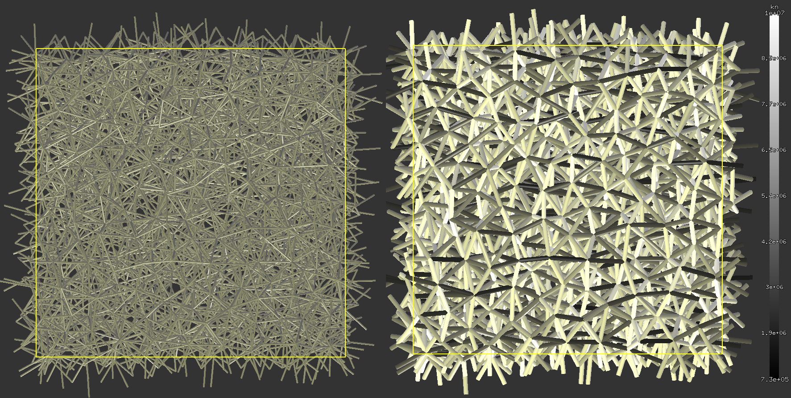

.. sectionauthor:: Václav Šmilauer <eu@doxos.eu>

==============================================
Cross-anisotropy model with discrete elements
==============================================

Summary
--------

The task was to prepare theoretical foundation for **modelling rock with cross-anisotropic elasticity** (schistosity) by using modified DEM formulation.

The following paragraphs present derivation of local stiffnesses of geometrically isotropic linear-elastic lattice leading to globally cross-anisotropic behavior. Lattice elements are assumed to have only normal and shear stiffnesses, which are made dependent on the element orientation. The derivation is based on the microplane theory regarded as continuous limit of a dense lattice, and the Voigt hypothesis of uniform displacement of lattice nodes. Microplane moduli are made orientation-dependent in the same way as for the lattice, via a function which allows us to carry out analytical integration of the stiffness tensor.

Geometrically isotropic lattices can be found within the Discrete Element Method (DEM) with spherical particles, where the mechanical structure is a transient lattice. Due to the local Voigt hypothesis, only packings with relatively high number of contacts per particle will fulfill our assumptions; this can be achieved by introducing distant contacts between particles which are not geometrically touching, a common practice for modeling cohesive materials.

Element tests on a periodic lattice structure were done, and simulation results were compared with stiffness tensor based on which the lattice stiffnesses were assigned.

Behavior of circular cavity under radial pressure was examined using this model; this is shown at the very end.

.. note:: The results presented here can be reproduced by downloading the following scripts:

   * :download:`pbc-prepare-sample.py <downloads/pbc-prepare-sample.py>` to prepare monomodal periodic packing with porosity equal to 0.5; alternatively, download :download:`pbc-spheres_N=2556,r=0.03,rRelFuzz=0.txt <downloads/pbc-spheres_N=2556,r=0.03,rRelFuzz=0.txt>` which is the result of running this script
   * :download:`pbc-deform-sample.py <downloads/pbc-deform-sample.py>` to run a single element test on the whole periodic lattice
   * :download:`pbc-deform-sample.table.xls <downloads/pbc-deform-sample.table.xls>` as input to batch for running element tests on a range of the :math:`I_R` parameters by using::

      woo-batch pbc-deform-sample.table.xls pbc-deform-sample.py

   * :download:`pbc-process-logs.py <downloads/pbc-process-logs.py>` to extract resulting tables (such as those presented in :ref:`contact-radius-IR-1.8`) from log files, once the batch is completed.

   :obj:`woo.dem.Cp2_FrictMat_FrictPhys_CrossAnisotropy` implements the cross-anisotropic stiffness computation, :obj:`woo.utils.muStiffnessScaling <_utils2.muStiffnessScaling>` implements computation of the :math:`\mu` proportionality coefficient, and :obj:`woo.dem.WeirdTriaxControl` was used for stress-controlled element tests.

.. admonition:: Acknowledgement

   This work was done during post-doc position at `Arbeitsbereich für Geotechnik und Tunnelbau <http://uibk.ac.at/geotechnik>`__ at the `University of Innsbruck <http://uibk.ac.at>`__; limited part of this work was `presented <http://www.scribd.com/doc/234669103/Blioumi-Smilauer-Cross-anisotropic-Rock-Modelled-with-Discrete-Methods-EURO-TUN-2013>`__ at the EURO:TUN 2013 conference, but the full version including all derivations never made it to a proper publication.

Introduction
--------------

Cross-anisotropic (also `transverse-isotropic <http://en.wikipedia.org/wiki/Transverse_isotropy>`__) materials exhibit rotational symmetry in mechanical response about the cross-anisotropy axis :math:`\vec{a}`: the material behaves isotropically perpendicular to :math:`\vec{a}`. Such behavior is often found in layered materials. For the case where :math:`\vec{a}` coincides with the global :math:`z`-axis, this symmetry is captured by the stiffness tensor

..  math::

   \tens{C}=
      \begin{pmatrix}
         C_{11} & C_{12} & C_{13} & 0 & 0 & 0  \\
         C_{12} & C_{11} & C_{13} & 0 & 0 & 0  \\
         C_{13} & C_{13} & C_{33} & 0 & 0 & 0  \\
         0 & 0 & 0 & C_{44} & 0 & 0 \\
         0 & 0 & 0 & 0 & C_{44} & 0 \\
         0 & 0 & 0 & 0 & 0 & \frac{C_{11}-C_{12}}{2} 
      \end{pmatrix}
  
with five independent components.

Lattice
^^^^^^^^
      
The objective of this paper is to model a linear-elastic cross-anisotropic medium using a discrete model. Under discrete models we understand the Discrete Element Method (DEM) with spherical particles, though we are only interested in the static solution in the linear domain. Therefore, an arrangement of DEM particles with contacts in-between them can be seen as a lattice structure, where the contacts (lattice elements) describe interactions with neighboring particles (lattice nodes). We will thus speak of lattice elements, and only turn to the DEM terminology when required.
      
Constructing the lattice from an arrangement of spherical particles is shown in :ref:`this figure <fig-contact-radius>`; the procedure is of geometrical nature, where spheres with positions :math:`\vec{x}_i` and radii :math:`r_i` are in contact if

.. math:: 
   :label: eq-IR

   \lvert\vec{x}_1-\vec{x}_2\rvert≤I_R(r_1+r_2)

where :math:`I_R` is *contact radius* :cite:`Stransky2010`, dimensionless parameter determining density of the lattice. *I_R* is equal to 1 if only geometrically adjacent spheres are to be considered in contact, while greater values will allow "contact" between spheres which some distance between them.

.. _fig-contact-radius:

.. figure:: fig/contact-radius-lattice.*
   :figclass: align-center
   :width: 80%

   Dependence of lattice density on contact radius :math:`I_R`: (a) sphere packing for constructing the lattice, (b) lattice with :math:`I_R=1`, (b) lattice with bigger :math:`I_R`.

The cross-anisotropic behavior is described by the stiffness tensor. With continuum models, the constitutive law is written in terms of the stiffness tensor itself; however, discrete models are not homogeneous and a distinction between local (microscopic) and global (macroscopic) levels of description is to be made. In the local sense, each lattice element is be characterized by stiffness values. Globally, though, the behavior is given by complicated interplay between numerous lattice elements.
      
Our task is therefore to investigate the relationship between local and global lattice behavior: providing a mathematical description of how the global behavior (expressed as a stiffness tensor) depends on local characteristics (stiffnesses of lattice elements) and how are they playing together (lattice geometry). Subsequently, we will inverse the previous result, i.e. for some desired stiffness tensor, we will determine local characteristics (stiffnesses) leading to the behavior described by that tensor.

To this end, we make use of the following assumptions:

* elements of the lattice have only normal and shear stiffnesses :math:`k_n`, :math:`k_t`;
* the lattice is geometrically isotropic: the orientation of the lattice elements is *in average* uniformly distributed;
* the displacement of lattice nodes does not deviate from the mean displacement; in another words, the lattice is deformed uniformly, as whole. This assumption is commonly referred to as *Voigt hypothesis* :cite:`Liao1997` and is an important restriction for the lattice behavior. Denser lattices (with greater :math:`I_R`) fulfill this assumption by themselves better than loose lattices, as they have more contacts restricting deviation of individual nodes from the surrounding deformation. We therefore expect our results to better describe the real behavior in the case of dense lattices.

Microplane and lattice
^^^^^^^^^^^^^^^^^^^^^^^^

The transition between discrete (lattice) :cite:`Kuhl2001` and continuous description will be done via the *microplane* theory :cite:`Carol2004`. This theory describes each material point as infinite number of microplanes oriented uniformly in all possible directions at that material point, each of them characterized by volumetric, deviatoric, normal and shear moduli (in our case, we only use the latter two, :math:`E_N` and :math:`E_T`). The cross-anisotropic nature is introduced by supposing dependency of those moduli on the respective microplane orientation such that symmetries of a cross-anisotropic medium are satisfied. The stiffness tensor is obtained by *integration of the moduli* over all microplanes.
      
The lattice structure has only a finite number of nodes and a finite number of isotropically-oriented lattice elements in each node. The stiffness tensor is obtained by *summation of stiffnesses* over all elements. We can write the lattice stiffnesses :math:`k_n`, :math:`k_t` as functions of some yet unknown moduli :math:`E_N'`, :math:`E_T'` (which depend on the orientation in the same way as :math:`E_N`, :math:`E_T`) and let the lattice density grow without bounds. After limit transition, we obtain the stiffness tensor of the infinitely dense lattice by *integration of the unknown moduli* over all lattice elements.

By imposing equality of microplane and lattice stiffness tensors, we obtain the values of the unknown lattice moduli :math:`E_N'`, :math:`E_T'` (proportional to the microplane moduli via a yet unknown factor :math:`\mu`); using those moduli when constructing the lattice ensures that the stiffness tensor of the discrete lattice will be equal to the stiffness tensor of the microplane model. Consequently, for a given stiffness tensor, we can compute lattice moduli which will lead to the response characterized by that stiffness tensor.

The function expressing how moduli depend on the orientation is the same for the microplane and the lattice model; in our case, we chose a function with only 4 independent parameters. Thus, the resulting stiffness tensor is cross-anisotropic, but has only four linearly independent components.

Tests
^^^^^^

The stiffness tensor of a lattice is obtained from *element tests* (in our case, uniaxial unconfined compression and simple shear tests) on a periodic lattice. It is subsequently compared with the prescribed values, and the dependence between accuracy and lattice density is shown.

Notation
---------
.. For spherical coordinates, we use physics convention::math:`\theta\in\langle 0,\pi)` is the inclination angle (from the pole), :math:`\phi\in\langle 0,2\pi)` is azimuth; :math:`r` (radius) is unused, since integrations are done over unit spheres. We employ abbreviations :math:`{{\mathrm s}\theta\,}=\sin\theta`, ${{\mathrm c}\theta\,}=\cos\theta$, ${{\mathrm s}\phi,}=\sin\phi$, ${{\mathrm c}\phi,}=\cos\phi$.

.. list-table::

   * - :math:`E_N`, :math:`E_T`
     - microplane normal and tangential moduli
   * - :math:`E_N'`, :math:`E_T'`
     - lattice normal and tangential moduli
   * - :math:`k_n`, :math:`k_t`
     - lattice normal and tangential stiffnesses 
   * - :math:`E_*^a`, :math:`{E_*^a}'`
     - in-plane microplane/lattice moduli 
   * - :math:`E_*^b`, :math:`{E_*^b}'`
     - out-of-plane microplane/lattice moduli 
   * - :math:`\tens{E}`
     - stiffness tensor
   * - :math:`C_{ijkl}`
     - stiffness tensor, index notation 
   * - :math:`C_{mn}`
     - stiffness matrix (in Voigt notation) element 
   * - :math:`\mathcal{E}`
     - :math:`(E_N^a, E_N^b,E_T^a,E_T^b)^T`
   * - :math:`\mathcal{E}'`
     - :math:`({E_N^a}', {E_N^b}', {E_T^a}',{E_T^b}')^T`
   * - :math:`\mathcal{C}`
     - :math:`(C_{11}, C_{33}, C_{13}, C_{12})^T` 

   * - :math:`\phi\in\langle 0,2\pi)` 
     - azimuth angle in spherical coordinates 
   * - :math:`\theta\in\langle 0,\pi)` 
     - inclination angle in spherical coordinates, from the pole
   * - :math:`{\rm s}\theta`, :math:`{\rm s}\phi`
     - :math:`\sin\phi`, :math:`\sin\theta`
   * - :math:`{\rm c}\theta`, :math:`{\rm c}\phi`
     - :math:`\cos\phi`, :math:`\cos\theta` 

Cartesian coordinates of a point :math:`\theta`, :math:`\phi` on sphere with radius :math:`r` are given (see :ref:`the image <fig-polar-coords>` as

.. math::
   :label: eq-nijk

   \vec{n}=\begin{pmatrix}r {\rm s}\theta{\rm c}\phi \\ r {\rm s}\theta{\rm s}\phi \\ r{\rm c}\theta\end{pmatrix}

with the transformation Jacobian equal to :math:`r^2 {\rm s}\theta`:

.. _fig-polar-coords:

.. figure:: fig/polar-coords.*
   :figclass: align-center
   :width: 30%

   Polar coordinate system; :math:`r`, :math:`\theta`, :math:`\phi` are radius, inclination, azimuth respectively.

Microplane stiffness tensor
----------------------------
We consider the microplane model by :cite:`Carol2004` where all microplanes only have normal and shear moduli :math:`E_N`, :math:`E_T` volumetric and deviatoric moduli :math:`E_V`, :math:`E_D` are zero. Stiffness tensor is obtained by integration of moduli over all possible orientations of microplanes given by unit vector :math:`\vec{n}`. For our purposes, we will integrate in spherical coordinates with unit radius over angles :math:`\theta`, :math:`\phi` (:ref:`polar coordinates <fig-polar-coords>`), :math:`z`-axis being coincident with the cross-anisotropy axis; this lets us write microplane moduli as :math:`E_N=E_N(\theta)` and :math:`E_T=E_T(\theta)`, independent of the azimuth :math:`\phi`.

.. math::
   :label: eq-stiff-integral

   \tens{\mathcal{C}}&=\frac{3}{2\pi}\int\limits_{\Omega} E_N\tens{\mathcal{N}}\otimes\tens{\mathcal{N}} + E_T \tens{\mathcal{T}}^T\cdot\tens{\mathcal{T}}\d\Omega= \\ 
      &=\frac{3}{2\pi}\int\limits_{\theta=0}^{\pi}\int\limits_{\phi=0}^{2\pi} \left(E_N\tens{\mathcal{N}}\otimes\tens{\mathcal{N}} + E_T \tens{\mathcal{T}}^T\cdot\tens{\mathcal{T}}\right){{\mathrm s}\theta\,}\d\phi\d\theta

where :math:`\tens{\mathcal{N}}`, :math:`\tens{\mathcal{T}}` are projection tensors; in index notation, they read

.. math:: 

         \tens{\mathcal{N}}\otimes\tens{\mathcal{N}}&=\tens{n}\otimes\tens{n}\otimes\tens{n}\otimes\tens{n}=n_i n_j n_k n_l \\
         \tens{\mathcal{T}}&=\tens{n}\cdot\tens{\mathcal{I}}^{\rm sym}-\tens{n}\otimes\tens{n}\otimes\tens{n} \\
         \tens{\mathcal{T}}^{T}&=\tens{\mathcal{I}}^{\rm sym}\cdot{n}-\tens{n}\otimes\tens{n}\otimes\tens{n} \\
         T_{ijk}&=n_l\frac{1}{2}(\delta_{lj}\delta_{ik}+\delta_{lk}\delta_{ij})-n_i n_j n_k \\
         T^T_{ijk}&=n_l\frac{1}{2}(\delta_{ik}\delta_{jl}+\delta_{il}\delta_{jk})-n_i n_j n_k \\
         \tens{\mathcal{T}}^T\cdot \tens{\mathcal{T}} &= T^T_{ijm} T_{mkl} = \\
            &=\frac{n_j n_k}{4} \delta_{il}+\frac{n_j n_l}{4}\delta_{ik}+\frac{n_i n_k}{4}\delta_{jl}+\frac{n_i n_l}{4}\delta_{jk}-n_i n_j n_k n_l

Stiffness tensor components are subsequently written as

.. math::
   :label: eq-Eijkl

   C_{ijkl}&=\frac{3}{2\pi}\int\limits_0^{2\pi}\int\limits_0^{\pi}\Big[E_N(\theta)(n_i n_j n_k n_l)+E_T(\theta)\Big(\frac{n_j n_k}{4} \delta_{il}+\frac{n_j n_l}{4}\delta_{ik}+ \\
   &\quad+\frac{n_i n_k}{4}\delta_{jl}+\frac{n_i n_l}{4}\delta_{jk}-n_i n_j n_k n_l\Big)\Big]{{\mathrm s}\theta\,}\d\phi\d\theta

Plugging :math:`\vec{n}` in :eq:`eq-nijk` into :eq:`eq-Eijkl`, and reversing integration order, we obtain

.. math::

   C_{1111}&=\frac{3}{2\pi}\int\limits_{\theta=0}^{\pi}{\int\limits_{\phi=0}^{2\pi}{\left[E_N {{\mathrm s}^4\theta\,} {{\mathrm c}^4\phi\,} + E_T({{\mathrm s}^2\theta\,}{{\mathrm s}^2\phi\,}-{{\mathrm s}^4\theta\,}{{\mathrm c}^4\phi\,})\right]{{\mathrm s}\theta\,}\,{\rm d}\theta}\,{\rm d}\phi}\,{\rm d}\theta = \\
      &=\frac{3}{2\pi}\int\limits_{\theta=0}^{\pi}{E_N{{\mathrm s}^5\theta\,}\int\limits_{0}^{2\pi}{{{\mathrm c}^4\phi\,}\,{\rm d}\phi}+E_T{{\mathrm s}^3\theta\,}\int\limits_{0}^{2\pi}{{{\mathrm c}^2\phi\,}\,{\rm d}\phi}-E_T{{\mathrm s}^5\theta\,}\int\limits_{0}^{2\pi}{{{\mathrm c}^4\phi\,}\,{\rm d}\phi}}\,{\rm d}\theta

As the inner integrals over :math:`\phi` do not depend on :math:`\theta`, they can be evaluated directly, giving

.. math::
   :label: eq-c1111-gen

      C_{1111}&=\frac{3}{2}\int\limits_{\theta=0}^{\pi}{\frac{3}{4}E_N{{\mathrm s}^5\theta\,}+ E_T{{\mathrm s}^3\theta\,}-\frac{3}{4}E_T{{\mathrm s}^5\theta\,}}\,{\rm d}\theta.

Similarly for other components,

.. math::
   :label: eq-c2323-gen

         C_{2222}&=C_{1111} \\
         C_{3333}&=\frac{3}{2}\int\limits_{0}^{\pi}{2E_N{{\mathrm c}^4\theta\,}{{\mathrm s}\theta\,}+2E_T{{\mathrm c}^2\theta\,}{{\mathrm s}\theta\,}-2E_T{{\mathrm c}^4\theta\,}{{\mathrm s}\theta\,}}\,{\rm d}\theta \\
         C_{2233}&=\frac{3}{2}\int\limits_{0}^{\pi}{E_N{{\mathrm s}^3\theta\,}{{\mathrm c}^2\theta\,}-E_T{{\mathrm s}^3\theta\,}{{\mathrm c}^2\theta\,}}\,{\rm d}\theta \\
         C_{1133}&=C_{2233} \\
         C_{1122}&=\frac{3}{2}\int\limits_{0}^{\pi}{\frac{1}{4}E_N{{\mathrm s}^5\theta\,}-\frac{1}{4}E_T{{\mathrm s}^5\theta\,}}\,{\rm d}\theta \\
         C_{2323}&=\frac{3}{2}\int\limits_{0}^{\pi}{E_N{{\mathrm s}^3\theta\,}{{\mathrm s}^2\theta\,}+E_T\left(\frac{{{\mathrm c}^2\theta\,}{{\mathrm s}\theta\,}}{4\pi}+\frac{{{\mathrm s}^3\theta\,}}{4}-{{\mathrm s}^3\theta\,}{{\mathrm c}^2\theta\,}\right)} \,{\rm d}\theta \\
         C_{1313}&=C_{2323} \\
         C_{1212}&=\frac{3}{2}\int\limits_{0}^{\pi}{\frac{1}{4}E_N{{\mathrm s}^5\theta\,}+E_T\left(\frac{{{\mathrm s}^3\theta\,}}{2}-\frac{{{\mathrm s}^5\theta\,}}{4}\right)}\,{\rm d}\theta= \\
            &=\frac{1}{2}\left(C_{1111}-C_{1122}\right)

Note that only 5 of the stiffness tensor components are independent, which is consistent with the symmetries of the cross-anisotropic material.

Isotropy
^^^^^^^^^^
With :math:`\theta`-independent :math:`E_N` and :math:`E_N`, :math:`C_{ijkl}` can be evaluated explicitly and assumes the values given in literature :cite:`Kuhl2001`, :cite:`Stransky2010`, i.e.

.. math::
   :label: eq-c1111-iso

            C_{1111}=C_{2222}=C_{3333}&=\frac{1}{5}(6E_N+4E_T), \\
            C_{2233}=C_{1133}=C_{1122}&=\frac{1}{5}(2E_N-2E_T), \\
            C_{2323}=C_{1313}=C_{1212}&=\frac{1}{5}(2E_N+3E_T).

Cross-anisotropy
^^^^^^^^^^^^^^^^^

:math:`E_N` and :math:`E_T` are functions of inclination :math:`\theta\in\langle0,\pi\rangle`. To further evaluate the stiffness tensors, we will assume that they can be written as functions interpolating between in-plane moduli :math:`E_*^a` and out-of-plane-moduli :math:`E_*^b`, via some weight function :math:`w(\theta)`:

.. math::
   :label: eq-Ent-w

   E_N(\theta)&=w(\theta)E_N^a+(1-w(\theta))E_N^b

   E_T(\theta)&=w(\theta)E_T^a+(1-w(\theta))E_T^b.

We require the function :math:`w` to be

* interpolating between in-plane and out-of-plane values, i.e. :math:`w(0)=0`, :math:`w(\pi/2)=1`;
* continuous in :math:`\langle 0, \pi/2\rangle`;
* symmetrical around :math:`\pi/2`, i.e. :math:`\forall\theta: w(\theta)=w(\pi/2-\theta)`.

Elliptic interpolation
'''''''''''''''''''''''

One candidate for :math:`w`, used in the rest of this paper, is the function

.. math::
   :label: eq-w-elliptic

   w(\theta)&={{\mathrm s}^2\theta\,},
   
   1-w(\theta)&={{\mathrm c}^2\theta\,}.

.. _fig-elliptic-interp:

.. figure:: fig/elliptic-interp.*
   :align: center
   :width: 40%

   Elliptic interpolation of stiffnesses.

.. \draw[->] (-2.2,0) -- (2.2,0) node[right] {$x,y$};
   \draw[->] (0,-2.4) -- (0,3) node[above right] {$z$};
   \draw[thick] (0,0) ellipse (1.3 and 2);
   \node[below right] at (1.3,0) {$E_N^a$}; \fill (1.3,0) circle(2pt);
   \node[above right] at (0,2) {$E_N^b$};\fill (0,2) circle(2pt);
   \coordinate (P) at  (1.1258,1);
   \fill (P) circle(1.5pt);
   \draw[<->,very thick] (0,0) -- (P);
   \node at (.9,.3) {$E(\theta)$};
   \draw[->] (0,.5) arc (90:41.61:.5);
   \node[above left] at (.5,.5) {$\theta$};

The advantage is that the interpolation function has simple elliptical shape and that we are able to evaluate stiffness tensor components in a closed form. The disadvantage is that :math:`w` contains no additional parameter, therefore only 4 stiffness tensor components will be independent; however, such an approximation can be in many cases accurate enough; we will choose the out-of-plane shear modulus :math:`C_{44}` to be the dependent component, for it is difficult to measure experimentally :cite:`Blioumi2011`, but any other component could be selected instead.
         
Plugging :eq:`eq-w-elliptic` into :eq:`eq-Ent-w`, and then into :eq:`eq-c1111-gen` − :eq:`eq-c2323-gen`, we obtain all stiffness tensor components as function of the lattice moduli,

.. math::
   :label: eq-Celliptic

   \begin{pmatrix}C_{1111} \\ C_{3333} \\ C_{2233} \\ C_{1122} \\ C_{2323} \end{pmatrix} =
   \begin{pmatrix}C_{11}\\C_{33}\\C_{13}\\C_{12}\\C_{44}\end{pmatrix}=
      \frac{1}{35}
      \begin{pmatrix}
         36 & 6 & 20 & 8 \\ % E_1111
         12 & 30 & 16 & 12 \\ % E_3333
         8 & 6 & -8 & -6 \\ % E_2233
         12 & 2 & -12 & -2 \\ % E_1122
         8 & 6 & 13 & 8 \\ % E_2323
      \end{pmatrix}
      \begin{pmatrix}E_N^a \\ E_N^b \\ E_T^a \\ E_T^b \end{pmatrix}.

Writing out the independent components separately, we obtain

.. math::

   \begin{pmatrix}C_{11}\\C_{33}\\C_{13}\\C_{12}\end{pmatrix}&=
   \frac{1}{35}
      \begin{pmatrix}
         36 & 6 & 20 & 8 \\ % E_1111
         12 & 30 & 16 & 12 \\ % E_3333
         8 & 6 & -8 & -6 \\ % E_2233
         12 & 2 & -12 & -2 \\ % E_1122
      \end{pmatrix}
     \begin{pmatrix}E_N^a \\ E_N^b \\ E_T^a \\ E_T^b \end{pmatrix}

or in a compact form

.. math::
   :label: eq-Celliptic-compact

   \mathcal{C}&=\mat{A}\mathcal{E}

with the dependent component

.. math::
   :label: eq-C44-dep

   C_{44}&=\frac{1}{35}\begin{pmatrix}8& 6& 13& 8\end{pmatrix}\mathcal{E}=\begin{pmatrix}\frac{1}{4}& \frac{1}{4}& -\frac{1}{2}& 0\end{pmatrix} \mathcal{C}.

Since the :math:`\mat{A}` matrix is invertible, we can determine :math:`\mathcal{E}` for given values of :math:`\mathcal{C}` as

.. math::
   :label: eq-Eelliptic-compact

   \mathcal{E}&=\mat{A}^{-1}\mathcal{C}. 

Lattice stiffness tensor
-------------------------

We start with a lattice composed of elements characterized by normal and shear stiffnesses :math:`k_n`, :math:`k_t`. Since we want to compare lattice with the microplane model, we will write lattice element stiffnesses as functions of some lattice moduli :math:`E_N'`, :math:`E_T'`; we will further suppose that :math:`E_N'`, :math:`E_T'` are orientation-dependent as in :eq:`eq-Ent-w`, with different in-plane and out-of-plane moduli :math:`\mathcal{E}'`. 
      
Without loss of generality, we consider that the lattice is constructed from spherical packing and that intra-nodal stiffnesses are given as :math:`k_n=E_N'\pi r^2 /(2r')`, where :math:`\pi r^2` is a fictitious contact area divided by the contact length :math:`2r'`; depending on the algorithm, the actual stiffness can be different up to multiplicative constant, so we will write

.. math::
   :label: eq-kn-En
   :nowrap:

   \begin{align*}
      k_n &=E_N'\frac{\hat\pi r^2}{2r'}, & k_t&=E_T'\frac{\hat\pi r^2}{2r'}.
   \end{align*}

In the case we mentioned, :math:`\hat\pi=\pi` but we assume no particular value in the following.

Stiffness tensor of a lattice is, assuming Voigt hypothesis of uniform node displacements, written as :cite:`Kuhl2001` (eq. (35)):

.. math::
   :label: eq-tE-knkt

   \tens{\mathcal{C}}&=\frac{1}{V}\sum|l|^2\left[k_n \tens{\mathcal{N}}\otimes\tens{\mathcal{N}} +k_t\tens{\mathcal{T}}^T\cdot\tens{\mathcal{T}}\right],

where :math:`|l|=(2r')` is the length of a lattice element. After limit transition, for some representative volume :math:`V` and large number of lattice elements :math:`N`, the tensor is written as an integral over all orientations

.. math::
   :label: eq-tE-integral

   \tens{\mathcal{C}}&=\frac{N}{4V\pi}\int_\Omega (2r')^2 \left( k_n \tens{\mathcal{N}}\otimes\tens{\mathcal{N}} +k_t\tens{\mathcal{T}}^T\cdot\tens{\mathcal{T}}\right) \d\Omega,

where :math:`(2r')` was kept inside the integral, as it is not a constant. Plugging in stiffnesses from :eq:`eq-kn-En` yields

.. math::
   :label: eq-tE-a

   \tens{\mathcal{C}}&= \frac{N}{2V\pi}\hat\pi \overline{r^2r'}\int_{\Omega}E_N'\tens{\mathcal{N}}\otimes\tens{\mathcal{N}}+E_T'\tens{\mathcal{T}}^T\cdot\tens{\mathcal{T}} \d\Omega.

where the :math:`r^2r'` term appearing inside the integral was written in the front as an average, because it is on average orientation-independent.
         
Microplane-lattice moduli proportion
-------------------------------------

Microplane moduli :math:`E_N`, :math:`E_T` and lattice moduli :math:`E_N'`, :math:`E_T'` have the same dimensions and both depend on the orientation via :eq:`eq-Ent-w`; they are therefore related via an unknown dimensionless parameter :math:`\mu`

.. math::
   :label: eq-e-e'
   
   E_N=\mu E_N',

   E_T=\mu E_T'.

We can plug this relation into :eq:`eq-stiff-integral` obtaining

.. math::
   :label: eq-tE-b

   \tens{\mathcal{C}}&=\frac{3}{2\pi}\mu\int_{\Omega} E_N'\tens{\mathcal{N}}\otimes\tens{\mathcal{N}} + E_T' \tens{\mathcal{T}}^T\cdot\tens{\mathcal{T}}\d\Omega.

By putting :eq:`eq-tE-a` and :eq:`eq-tE-b` equal, we solve

.. math::
   :label: eq-mu

   \mu&=\frac{E_N}{E_N'}=\frac{E_T}{E_T'}=\frac{1}{3}\frac{N\overline{r'r^2}\hat\pi}{V}

If we consider the special case of :math:`r` and :math:`r'` being constant, we can omit the average and write :math:`\mu` in the form better revealing its geometrical meaning as

.. math:: \mu&=\frac{1}{6}\frac{N (\hat\pi r^2)(2r')}{V}=\frac{1}{6}\frac{N A l}{V}

with :math:`A=\hat\pi r^2` and :math:`l` being is the cross-section area and length of one lattice element; the fraction is therefore proportion between the stiff volume of lattice elements :math:`NAl` to the overall volume :math:`V`.

Stiffness tensor from lattice moduli
^^^^^^^^^^^^^^^^^^^^^^^^^^^^^^^^^^^^^

Since stiffness tensor components :math:`C_{ij}` are linear with respect to microplane moduli :math:`E_*`, we can write :math:`C_{ij}(E_*)=C_{ij}(\mu E_*')=\mu C_{ij}(E_*')`. Thus, for instance, :eq:`eq-c1111-iso` becomes

.. math::
         C_{1111}&=\frac{1}{5}(6E_N+4E_T)=\mu\frac{1}{5}(6E_N'+4E_T')

and :eq:`eq-Celliptic-compact`, :eq:`eq-Eelliptic-compact` become respectively

.. math::
   :label: eq-Celliptic-micro

    \mathcal{C}&=\mu\mat{A}\mathcal{E}'

and 

.. math::
   :label: eq-Eelliptic-micro

    \mathcal{E}'&=\frac{1}{\mu}\mat{A}^{-1}\mathcal{C}.

Element test
-------------

Random dense (porosity equal to 0.5) periodic packing of spheres with equal radius is considered. The lattice structure is created by finding contacts between particles with varying contact radius :math:`I_R` according to :eq:`eq-IR`. Local lattice moduli are computed using :eq:`eq-Ent-w` with the elliptic interpolation :eq:`eq-w-elliptic`. Cross-anisotropy axis is aligned with the global :math:`z`-axis. Given some input values of the :math:`\mathcal{C}` vector (i.e. :math:`C_{11}`, :math:`C_{33}`, :math:`C_{13}`, :math:`C_{12}`), we use the current packing geometry to determine :math:`\mu` via :eq:`eq-mu` and obtain :math:`\mathcal{E}'` via :eq:`eq-Eelliptic-micro`.

The goal is to compare stiffness tensor from 3 sources:

1. from prescribed :math:`\mathcal{C}`, additionally with the dependent component :math:`C_{44}` from :eq:`eq-C44-dep`;
2. from the current lattice stiffnesses using :eq:`eq-tE-knkt`;
3. from simulated lattice response during element tests (described below), with stiffnesses :eq:`eq-sim-Ex`, :eq:`eq-sim-Gij`, :eq:`eq-CC-from-EGnu`.
      
The test will be run for a range of contact radius :math:`I_R`; higher values of :math:`I_R` lead to stabilization of the packing, better satisfying the Voigt hypothesis of uniform deformation, as mentioned in the introduction. It is therefore expected that lower values of :math:`I_R` will overestimate the microplane/lattice stiffnesses with respect to the simulated response and that this difference will be smaller with growing :math:`I_R`. The minimum value of :math:`I_R` is 1.2, since smaller values yielded unstable lattices. A rendering of the lattice for is shown in fig. :ref:`Periodic lattice <fig-dem-lattice-3d>`.

.. _fig-dem-lattice-3d:

   Periodic lattice of the element test for :math:`I_R=1.4`, shown in the :math:`yz` plane. The right picture varies color depending on stiffness, showing the preference for more compliant behavior (dark) along the :math:`z` axis.

Evaluating the stiffness tensor
^^^^^^^^^^^^^^^^^^^^^^^^^^^^^^^

Homogeneous periodic lattice is loaded in order to obtain parameters of the cross-anisotropic material. For each axis, unconfined uniaxial compression is performed to obtain the normal modulus and Poisson's ratios, and shear test is performed to obtain the shear modulus (:ref:`<element test figure <fig-element-test-2d>`). In total, six tests (for each value of :math:`I_R`) are run. 

Within the 12 values (3 normal moduli, 3 shear moduli, 3 Poisson's ratios, each measured twice) obtained, there are 5 symmetric couples (:math:`E_{xy}=E_{yx}`, :math:`G_{yz}=G_{zx}`, :math:`\nu_{xy}=\nu_{yx}`, :math:`\nu_{yz}=\nu_{xz}`, :math:`\nu_{zx}=\nu_{zy}`) and 2 dependent values (e.g. :math:`\nu_{xz}=\nu_{zx}E_x/E_z` and :math:`G_{xy}=E_x/2(1+\nu_{xy})`). This results in five independent material constants of the cross-anisotropic material. The redundant values can be used to check correctness.

.. _fig-element-test-2d:

.. figure:: fig/element-test-2d.*
   :figclass: align-center
   :width: 90%

   Configuration of (a) unconfined uniaxial compression test in the :math:`y`-direction and (b) shear test in the :math:`xy` plane.

Normal moduli and Poisson's ratios
'''''''''''''''''''''''''''''''''''

To find normal moduli from simulations, we make use of the normal compliance relationship for an orthotropic material, of which cross-anisotropic material is a special case:

.. math::
   :label: eq-orthotropic-normal-compliance

   \begin{pmatrix}\eps_{xx} \\ \eps_{yy} \\ \eps_{zz}\end{pmatrix}=\begin{pmatrix}\frac{1}{E_x} & -\frac{\nu_{yx}}{E_y} & -\frac{\nu_{zx}}{E_z} \\ -\frac{\nu_{xy}}{E_x} & \frac{1}{E_y} & -\frac{\nu_{zy}}{E_z} \\ -\frac{\nu_{xz}}{E_x} & -\frac{\nu_{yz}}{E_y} & \frac{1}{E_z} \end{pmatrix}\begin{pmatrix}T_{xx} \\ T_{yy} \\ T_{zz} \end{pmatrix}

and prescribe extension :math:`\hat{\eps}` (the hat signifies that the value is prescribed) in one direction with zero lateral stresses and evaluate the response; since stress cannot be prescribed directly in DEM, we adjust lateral strains until stress is smaller than some relative tolerance :math:`t_r` times axial stress. Because the behavior is linear elastic, the way lateral strains are adjusted has no influence on the result. For instance, for :math:`x` extension we prescribe

.. math::

   \eps_{xx}&=\hat{\eps}_{xx}=\hat\eps, \\
   T_{yy}=T_{zz}&=0,

and use measured response :math:`T_{xx}`, :math:`\eps_{yy}`, :math:`\eps_{zz}` to compute

.. math::
   :label: eq-sim-Ex

   E_x&=\frac{T_{xx}}{\hat{\eps}_{xx}} \\
   \nu_{xy}&=-\eps_{yy}\frac{E_x}{T_{xx}}=-\frac{\eps_{yy}}{\hat{\eps}_{xx}} \\
   \nu_{xz}&=-\frac{\eps_{zz}}{\hat{\eps}_{xx}}.

Shear moduli
'''''''''''''
Shear test is purely deformation-controlled. The periodic cell is prescribed pure shear :math:`\eps_{ij}=\eps_{ji}=\hat\eps` (zero elsewhere). Shear moduli are found from shear stiffness equations

.. math::
   :label: eq-sim-Gij

   G_{ij}&=\frac{T_{ij}}{2\hat\eps_{ij}}=\frac{T_{ij}}{\gamma_{ij}}.

------------------------

Components of the stiffness tensor are found by inversion of orthotropic compliance matrix :eq:`eq-orthotropic-normal-compliance` using symmetries :math:`E_y=E_x` and :math:`\nu_{xz}=\nu_{yz}` and abbreviating :math:`e=E_x/E_z`, :math:`m=1-\nu_{xy}-2e\nu_{xz}^2` as

.. math::
   :label: eq-CC-from-EGnu

   \begin{pmatrix} C_{11} \\ C_{12} \\ C_{13} \\ C_{33} \\ C_{44}\end{pmatrix}&=\begin{pmatrix}E_x\frac{1-e\nu_{xz}^2}{(1+\nu_{xy})m} \\ E_x\frac{\nu_{xy}+e\nu_{xz}^2}{(1+\nu_{xy})m} \\ E_x\frac{\nu_{xy}}{m} \\  E_z\frac{1-\nu_{xy}}{m}  \\ G_{yz} \end{pmatrix}.

Numerical results
^^^^^^^^^^^^^^^^^^

.. _contact-radius-IR-1.8:

Contact radius :math:`I_R=1.8`
''''''''''''''''''''''''''''''

For the particular value of :math:`I_R=1.8`, the input values are as follows:

.. csv-table::

   "number of spheres", 2556
   "sphere radius", "0.03 m"
   "interaction radius :math:`I_r`",1.8
   ":math:`\hat\pi` parameter",":math:`\pi`"
   ":math:`C_{11}`", "130 MPa"
   ":math:`C_{33}`", "55 MPa"
   ":math:`C_{13}`", "28 MPa"
   ":math:`C_{12}`", "40 MPa"
   "rel. stress tolerance :math:`t_r`", ":math:`10^{-3}`"
   "prescribed axial strain :math:`\hat\eps`","-1%"

These are the derived values, computed from geometry of the actual lattice:

.. csv-table::

   "average number of contacts", 22
   "lattice density scaling :math:`\mu` :eq:`eq-mu`", 2.02
   ":math:`{E_N^a}'`", "59.7 MPa"
   ":math:`{E_N^b}'`", "5.94 MPa"
   ":math:`{E_T^a}'`", "2.84 MPa"
   ":math:`{E_T^b}'`", "0.989 MPa"

Simulation of normal loading yielded the following results; fives symmetric couples are marked with symbols (:math:`\dagger`, :math:`\ddagger`, :math:`*`, :math:`\circ`, :math:`+`), each line corresponds to one axis of compression:

.. math::
   :nowrap:

   \begin{align*}
		E_{x}&=103.8\,{\rm MPa}^{\circ}, & \nu_{xy}&=0.2244^{\ddagger}, & \nu_{xz}&=0.3962^{*},\\
		E_{y}&=103.1\,{\rm MPa}^{\circ}, & \nu_{yz}&=0.3916^{*}, & \nu_{yx}&=0.223^{\ddagger},\\
		E_{z}&=43.93\,{\rm MPa}^{}, & \nu_{zx}&=0.1669^{\dagger}, & \nu_{zy}&=0.1664^{\dagger},
   \end{align*}

while three pure shear simulations gave

.. math::
   :nowrap:

   \begin{align*}
			G_{yz}&=30.67\,{\rm MPa}^{+} , & 
			G_{zx}&=30.88\,{\rm MPa}^{+} , & 
			G_{xy}&=42.91\,{\rm MPa}^{} .
   \end{align*}

Dependent values can be written (we used averages for symmetric couples):

.. math::

		\nu_{xz}=\nu_{yz}=\frac{E_x}{E_z}\nu_{zx}&=0.392, \\
		G_{xy}=\frac{E_x}{2(1+\nu_{xy})}&=42.3\,{\rm MPa}. 

We see that both symmetric couples and dependent values are consistent, with some error due to imperfect isotropicity of the lattice geometry.

These are resulting stiffness tensor components (in MPa) from different sources; **bold** values were prescribed:

.. csv-table::
   :header: " ", :math:`C_{11}`, :math:`C_{33}`, :math:`C_{13}`, :math:`C_{12}`, :math:`C_{44}`

	"microplane :eq:`eq-Celliptic-micro`", **130** , **55** , **28**,  **40**, **32.2**
	"lattice :eq:`eq-tE-knkt`", 130, 55.1, 28.1, 40, 32.1
	  error ,  0.2%, 0.2%, 0.3%, 0.09%, -0.4%
	"simulations :eq:`eq-sim-Ex`, :eq:`eq-sim-Gij`, :eq:`eq-CC-from-EGnu`",  122, 52.8, 26.7, 37.9, 30.8
	  error ,  -5% , -3% , -4% , -5% , -4%

All element tests
''''''''''''''''''

The procedure described above was repeated for a range of contact radii :math:`I_R\in\{1.2, \dots, 2.8\}`; values lower than :math:`1.2` (for spheres of equal radii) lead to unstable packing, whereas high values bring no additional information.

This figure shows how the actual sample response (only :math:`C_{11}` is shown, figures for other values are similar) approaches the theoretical value for higher :math:`I_R` due to better stabilization of the packing, leading to more uniform deformation (the Voigt hypothesis). 

.. figure:: fig/element-stiffnesses.*
   :align: center
   :width: 60%

.. \begin{center}
      \tikzsetnextfilename{element-stiffnesses}
      \tikz{
         \begin{axis}[xlabel={Contact radius :math:`I_R`},ylabel={Stiffness :math:`C_{11}` (MPa)},grid=major,legend entries={microplane,lattice,element tests},legend pos={south east}]
            \addplot table[x=Ir,y=C11mp]{pbc-stiffnesses.txt};
            \addplot table[x=Ir,y=C11lat]{pbc-stiffnesses.txt};
            \addplot table[x=Ir,y=C11sim]{pbc-stiffnesses.txt};
         \end{axis}
      }
   \caption{Values of the :math:`C_{11}` stiffness for different contact radii.}

Conclusions
------------

An analytical derivation of orientation-dependent stiffness for geometrically isotropic lattice with global cross-anisotropic behavior was presented. The derivation was done withing the microplane framework, related to lattice behavior under the assumption of the Voigt hypothesis (uniform displacements). The orientation-dependent lattice stiffness was written as an interpolation function between in-plane and out-of-plane moduli, reducing the number of elastic parameters to four (instead of five for a general cross-anisotropic material). The :math:`\mu` coefficient relates lattice local moduli to global moduli using geometrical configuration of the lattice. Dense geometrically isotropic lattices can be obtained from the Discrete Element Method (DEM) for larger values of contact radius :math:`I_R`; this procedure was used to perform element tests on periodic lattice structures. It was shown that larger values of :math:`I_R` give better agreement between analytical and simulated stiffness tensor, due to stabilization leading to more uniform deformation.

Future work could use the best-fit deformation description :cite:`Liao1997` to determine global lattice stiffness to obtain lower estimate of the stiffness for cross-anisotropic medium, instead of the upper bound obtained with the Voigt hypothesis.

Videos
-------

Circular hole in DEM-discretized medium is subjected to radial hydrostatic pressure applied in the cavity. Contact stiffness are cross-anisotropic, with the strike angle :math:`\alpha=270^{\circ}` and the dip angle :math:`\beta=25^{\circ}`. This video shows behavior of the medium when the pressure is applied.

.. youtube:: KYCvi6SNOc0

It can be seen that:

* the sound wave propagates faster in the sense of higher stiffness (horizontally)
* the deformation is bigger in the sense of lower stiffness (vertically)
* radial loading leads to axial deformation due to cross-anisotropy axis not aligned with the cavity axis (it goes downwards under the angle :math:`\beta`).

