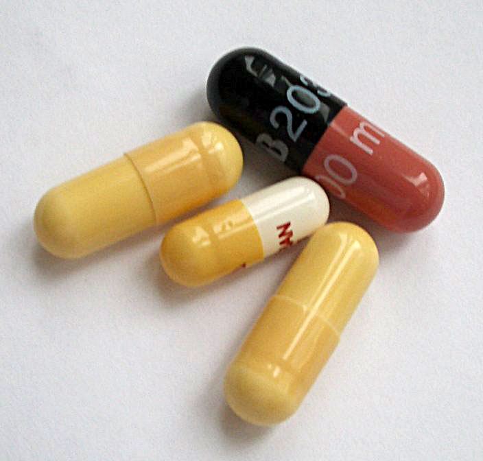
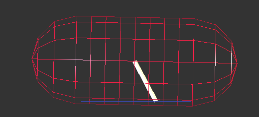

Capsule
--------

:obj:`Capsule <woo.dem.Capsule>` (`Wikipedia <http://en.wikipedia.org/wiki/Capsule_%28geometry%29>`__) is a cylinder with hemispherical ends, or a sphere swept along a segment. It is defined by :obj:`~woo.dem.Capsule.shaft` (the length of the segment, noted :math:`a`) and :obj:`~woo.dem.Capsule.radius` (:math:`r`). The segment is always oriented along the local :math:`x`-axis.

.. figure:: fig/capsule_geometry-wikipedia.*
	:align: center
	:width: 50%

	Geometry of a capsule particle.

Particle of this shapes are useful, among others, in the pharmaceutical industry or geomechanics.

	Pharmaceutical capsules (image courtesy of `wikipedia <http://en.wikipedia.org/wiki/File:Kapseln.JPG>`__).
	

Properties
^^^^^^^^^^^
The volume is computed as 

.. math:: V=V_c+V_a=\frac{4}{3}\pi r^3+\pi r^2 a.

Inertia is the sum of caps' (hemispheres) and shaft's (cylinder) inertia, applying `Parallel Axes Theorem <http://en.wikipedia.org/wiki/Parallel_Axes_Theorem>`__ along :math:`y` and :math:`z` axes:

.. math::
	:nowrap:

	\begin{align*}
		I_{xx}&=\rho\left[\frac{2}{5}V_c r^2 + \frac{1}{2}V_a r^2\right], \\
		I_{yy}=I_{zz}&=\rho\left[\frac{83}{320}V_c r^2+V_c\left(\frac{a}{2}+\frac{3}{8}r\right)^2+\frac{1}{12}V_a(3r^2+a^2) \right].
	\end{align*}

The centroid is always in the middle of the shaft due to symmetries. The radius of the bounding sphere is :math:`r+a/2`.

Capsule-capsule contact
^^^^^^^^^^^^^^^^^^^^^^^

This algorithm is implemented by :obj:`woo.dem.Cg2_Capsule_Capsule_L6Geom`. Determination of the contact is equivalent to finding minimum distance :math:`d` between segments of both capsules. Each segment's endpoints :math:`A_i`, :math:`B_i` are computed by multiplying local :math:`x`-axis by :math:`\pm a_i/2`. The algorithm is described in :cite:`Eberly1999Segments`.

The normal overlap is based directly on the distance as

.. math:: u_N=d-(r_1+r_2).

Determining contact point and normal purely geometrically would be discontinuous (small movement of the capsule would result in abrupt change); the reason is that the shaft (cylinder) is not convex and conforming contacts can be formed with other flat particles (such as :obj:`~woo.dem.Capsule` or :obj:`woo.dem.Wall`). The algorithm determines the distance between endpoints and the opposite capsule, filters out those without geometrical overlap. There are 16 possible combinations.

If there is one overlap, the purely geometrical contact point and normal applies. Otherwise, all overlaps are assigned weight :math:`w_i=d_i-(r_1+r_2)`, and contact points :math:`\vec{c}_i` and normals :math:`\vec{n}_i` are computed normally (middle point of the segment in the intersection volume) and interpolated between as in

.. math::
	:nowrap:
	
	\begin{align*}
		\vec{n}&=\frac{\sum w_i \vec{n}_i }{\sum w_i}, & \vec{c}&=\frac{\sum w_i \vec{c}_i}{\sum w_i}.
	\end{align*}

.. note:: The overlap :math:`u_N` is used in conjunction with contact point and normal which may not correspond geometrically to the place where :math:`u_N` occurs. This can lead to strange consequences, such as :obj:`L6Geom.vel[0] <woo.dem.L6Geom.vel>` not being the derivative of :obj:`~woo.dem.L6Geom.uN`. The advantages of this approach (that the movement of the contact point and the normal is continuous, and that we still meaningfully represent the contact by one point) seem to outweight such inconveniences.

Wall-capsule contact
^^^^^^^^^^^^^^^^^^^^
This algorithm is implemented by :obj:`woo.dem.Cg2_Wall_Capsule_L6Geom` and is similar to the capsule-capsule contact above; there is interpolation between max. two endpoints of the capsule touching the wall:

----------------------

.. youtube:: BksnzJ-D9dI

.. code-block:: python

	import math, woo, woo.core, woo.dem, woo.utils, woo.gl
	from minieigen import *

	S=woo.master.scene=woo.core.Scene(dtSafety=.1,throttle=0.01,fields=[woo.dem.DemField(gravity=(0,0,-10))])
	mat=woo.dem.FrictMat(young=1e6,ktDivKn=.2,density=3e3)
	S.dem.par.add([woo.utils.capsule((0,0,.5),radius=.3,shaft=.8,ori=Quaternion((0,1,0),-math.pi/8.),wire=True,mat=mat),woo.utils.wall(0,axis=2,sense=1,mat=mat)])
	S.dem.collectNodes()
	S.engines=woo.utils.defaultEngines(dynDtPeriod=100,damping=.4)
	S.saveTmp()

	# view setup
	woo.gl.Gl1_DemField.cPhys=True
	woo.gl.Gl1_CPhys.relMaxRad=.1
	woo.gl.Renderer.allowFast=False
	woo.gl.Renderer.iniViewDir=(0,-1,0)
	woo.gl.Gl1_Capsule.smooth=True

