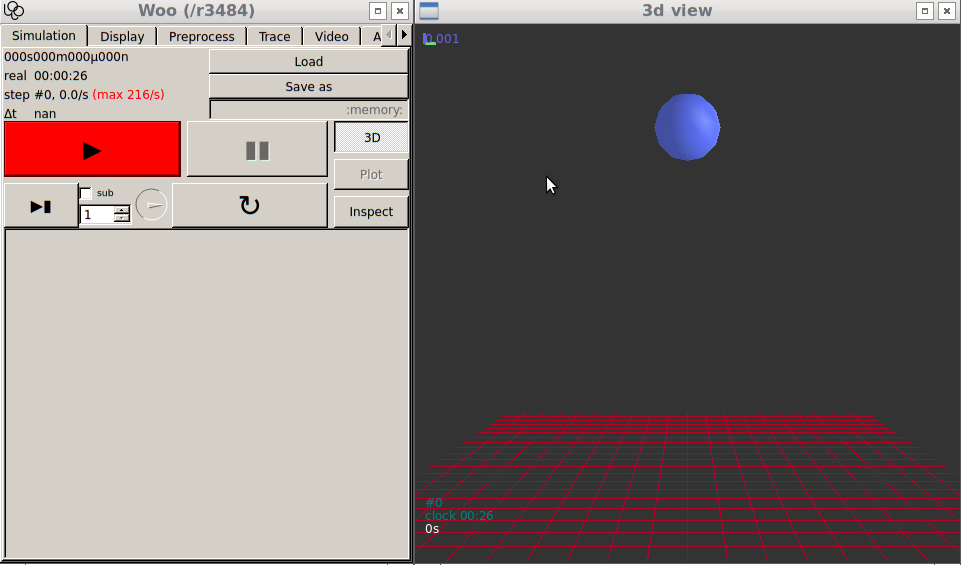

.. _tutorial-basic:

#################
Basic simulation
#################

.. admonition:: Overview

   This chapter explains how to write script for a very simple DEM simulation (a sphere falling onto plane) and how to run it.

Scene
=======

The whole simulation is contained in a single :obj:`woo.core.Scene` object, which contains the rest; a scene can be can be loaded from and saved to a file, just like any other object. Scene defines things like timestep (:obj:`~woo.core.Scene.dt`) or periodic boundary conditions (:obj:`~woo.core.Scene.cell`).

It also contains several :obj:`fields <woo.core.Field>`; each field is dedicated to a one simulation method, and the fields can be semi-independent. As we go for a DEM simulation, the important field for us is a :obj:`~woo.dem.DemField`; that is the one containing particles and contacts (we deal with that later); we can also define gravity acceleration for this field by setting :obj:`DemField.gravity <woo.dem.DemField.gravity>`.

There can be an unlimited number of scenes, each of them independent of others. Only one can be controlled by the UI (and shown in the 3d view); it is the one assigned to :obj:`woo.master.scene <woo.core.Master>`, the master scene object.

New scene with the DEM field can be initialized in this way:

.. code-block:: python

   import woo, woo.core, woo.dem   # import modules we use
   S=woo.core.Scene()              # create the scene object
   f=woo.dem.DemField()            # create the field object
   f.gravity=(0,0,-9.81)           # set gravity acceleration
   S.fields=[f]                     # add field to the scene
   woo.master.scene=S              # this will be the master scene now

Since all objects can take *keyword arguments* when constructed, and assignments can be chained in Python, this can be written in a much more compact way::

   S=woo.master.scene=woo.core.Scene(fields=[woo.dem.DemField(gravity=(0,0,-9.81))])

..
   asdfasdf

   .. ipython::

      Woo [1]: import woo, woo.core, woo.dem

      Woo [2]: woo.master.scene

The DEM field can be accessed as ``S.fields[0]``, but this is not very convenient. There is a shorthand defined, ``S.dem``, which always returns the (first) DEM field attached to the scene object.

Particles
==========

Particles are held in the :obj:`DemField.par <woo.dem.DemField.particles>` container (shorthand for :obj:`DemField.particles <woo.dem.DemField.particles>`); new particles can be added using the :obj:`append <woo.dem.DemField.append>` method.

Particles are not simple objects; they hold together :obj:`material <woo.dem.Material>` and :obj:`shape <woo.dem.Shape>` (the geometry -- such as :obj:`~woo.dem.Sphere`, :obj:`~woo.dem.Capsule`, :obj:`~woo.dem.Wall`, ...) and other thigs. :obj:`~woo.dem.Shape` is attached to one (for mononodal particles, like :obj:`spheres <woo.dem.Sphere>`) or several (for multinodal particles, like :obj:`facets <woo.dem.Facet>`) nodes with some :obj:`position <woo.core.Node.pos>` and :obj:`orientation <woo.core.Node.ori>`, each node holds :obj:`~woo.dem.DemData` containing :obj:`~woo.dem.DemData.mass`, :obj:`~woo.dem.DemData.inertia`, :obj:`velocity <woo.dem.DemData.vel>` and so on.

To avoid complexity, there are utility functions that take a few input data and return a finished :obj:`~woo.dem.Particle`.

We can define an infinite plane (:obj:`~woo.dem.Wall`) in the :math:`xy`-plane with :math:`z=0` and add it to the scene::

   wall=woo.dem.Wall.make(0,axis=2)
   S.dem.par.append(wall)

Walls are *fixed* by default, and the :obj:`woo.utils.defaultMaterial` was used as :obj:`~woo.dem.Particle.material` -- the default material is not good for real simulations, but it is handy for quick demos. We also define a :obj:`sphere <woo.dem.Sphere>` and put it in the space above the wall::

   sphere=woo.dem.Sphere.make((0,0,2),radius=.2)
   S.dem.par.append(sphere)

The :obj:`~woo.dem.ParticleContainer.append` method can also take several particles as list, so we can add both particles in a compact way::

   S.dem.par.append([
      woo.dem.Wall.make(0,axis=2),
      woo.dem.Sphere.make((0,0,2),radius=.2)
   ])

or in one line::

   S.dem.par.append([woo.dem.Wall.make(0,axis=2),woo.dem.Sphere.make((0,0,2),radius=.2)])

Besides creating the particles, it must also be said which nodes we actually want to have moving, i.e. subject to motion integration. In most basic cases, we will want all nodes to move, and there is a convenience function to collect all particles' nodes and put them into :obj:`S.dem.nodes <woo.core.Field.nodes>`::

   S.dem.collectNodes()

If we fail to do this, the integrator will collect them automatically, but will issue a warning.

Engines
========

After adding particles to the scene, we need to tell Woo what to do with those particles. :obj:`Scene.engines <woo.core.Scene.engines>` describe things to do. Engines are run one after another; once the sequence finishes, :obj:`~woo.core.Scene.time` is incremented by :obj:`~woo.core.Scene.dt`, :obj:`~woo.core.Scene.step` is incremented by one, and the sequence starts over.

Although the engine sequence can get complex, there is a pre-cooked engine sequence :obj:`DemField.minimalEngines <woo.dem.DemField.minimalEngines()>` suitable for most scenarios; it consists of the minimum of what virtually every DEM simulation needs:

* motion integration (compute accelerations from contact forces and gravity on nodes, update velocities and positions);
* collision detection (find particle overlaps)
* contact resolution (compute forces resulting from overlaps; without any other parameters, the linear contact model is used);

Assigning the engines is simple::

   S.engines=S.dem.minimalEngines(damping=.2)

Notice that we passed the :obj:`~woo.dem.Leapfrog.damping` parameter, which is necessary for models without internal dissipation; more on this later.

Extras
=======

Two handy things to do before we run the simulation:

1. Limit the simulation speed; this is never used for big simulations, but now we want to see things as they happen. We can insert a small pause after each step (here we use 5ms)::

      S.throttle=5e-3

2. Save the simulation so that we can quickly reload it using the :guilabel:`↻` (reload) button::

      S.saveTmp()

The :obj:`woo.core.Object.saveTmp` function saves to the memory, so everything will be lost when Woo finishes, but that is just fine now.

Running
========

All in all, the minimal simulation of a sphere falling onto plane looks like this:

.. note:: To avoid typing ``woo.dem`` all the time, the module :obj:`woo.dem` was imported as ``from woo.dem import *``; the same could be also done with the :obj:`woo.core` module.

.. literalinclude:: basic-1.py

Save this to a file, name it e.g. ``basic-1.py`` (or whatever ending with ``.py``, which is the extension indicating `Python <http://www.python.org>`__) and run woo from the terminal, passing the ``basic-1.py`` as argument to Woo. You must run Woo from the same directory as where the script is located (by default, new terminal opens in your home directory; if the ``basic-1.py`` is saved for example under ``~/Documents``, you have to type ``cd Documents`` first)::

   woo basic-1.py

You should see something similar to this::

   Welcome to Woo /r3484
   Running script basic-1.py
   [[ ^L clears screen, ^U kills line. F12 controller, F11 3d view, F10 both, F9 generator, F8 plot. ]]
   Woo [1]:

and the controller window opens. The script was executed, but the simulation is not yet running -- the script does not ask for that. Click on the :guilabel:`3D` button to look at the scene and something like this appears:

   User interface after running the :woosrc:`basic-1.py <doc/source/sphinx2/tutorial/basic-1.py>` script.

When you click the :guilabel:`▶` (play) button , you will see the simulation running:

.. youtube:: BOgc5FH-XzM

The :guilabel:`▶`  button is red as we set :obj:`S.throttle <woo.core.Scene.throttle>`; you can change the value using the dial under :guilabel:`▶`. Try also clicking :guilabel:`▮▮` (pause), :guilabel:`▶▮` (single step, or several steps as set next to it) and :guilabel:`↻` (that will load the state when you said ``S.saveTmp()``). The controller shows some basic data, some of which are also presented in the corner of the 3d view: time, step number, timestep.

Clicking the :guilabel:`Inspector` button will present internal structure of the simulation -- particles, engines, contacts (there will be no contact most the time, in this simulation). You can select a particle with by :kbd:`Shift-click` on the particle in the 3d view; it will be selected in the inspector as well.

The simulation can also be run from the script or the command line in terminal (starting with ``Woo [1]:``)::

   S.one()         # one step, like ▶▮
   S.run()         # run in background until stopped, like ▶
   S.stop()        # stop the simulation (does nothing if not running), like ▮▮
   S.run(200)      # run 200 steps in background
   S.wait()        # wait for the background to finish, then return

.. warning:: When the script is executed, it defines the ``S`` variable to point to your scene. When the scene is reloaded via :guilabel:`↻` (which invokes ``woo.master.reload``), :obj:`woo.master.scene <woo.core.Master.scene>` refers to the newly loaded scene, but ``S`` is still pointing to the old object:
   
   .. ipython::

      Woo [1]: import woo; S=woo.master.scene; S.dt=1e-9; S.saveTmp()

      Woo [1]: S, woo.master.scene      ## both point to the same scene -- look at the address

      Woo [1]: woo.master.reload()      ## reload the master scene

      Woo [1]: S, woo.master.scene      ## two different scenes

      Woo [1]: S.one()                  ## will run the OLD scene, but it won't be seen graphically :|

      Woo [1]: S=woo.master.scene       ## set S to the "good" value after reloading 

      Woo [1]: S.one()                  ## runs the current master scene, OK :)

All data in the scene can be accessed as well:

.. ipython::

   Woo [1]: from woo.dem import *; from woo.core import *; import woo; S=Scene(fields=[DemField(gravity=(0,0,-9.81),par=[Wall.make(0,axis=2),Sphere.make((0,0,2),.2)])],engines=DemField.minimalEngines(damping=.2)); S.run(100,True)

   Woo [1]: S.dem                    # the DEM field

   Woo [1]: S.dem.gravity=(0,0,-20)  # set different gravity acceleration

   Woo [1]: S.step                   # step number

   Woo [1]: S.dt                     # time-step

   Woo [1]: S.dem.par[0]             # first particle (numbering starts from 0)

   Woo [1]: S.dem.par[1]             # second particle

   Woo [1]: S.dem.par[-1]            # last particle; negative numbers from the end

   Woo [1]: S.dem.par[1].pos         # position of particle #1

   Woo [1]: S.dem.par[1].shape       # geometrical shape of particle #1

   Woo [1]: S.engines                # all engines
