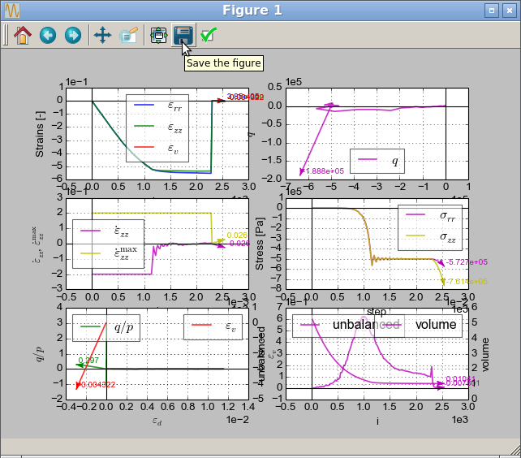

#######
Export
#######

.. admonition:: Overview

	This chapter explains how to export data from Woo into formats readable by other programs.

Plots
======

Plots as graphics
------------------

Plots can be exported as graphics into any format supported by Matplotlib (PDF, SVG, PNG, ...) by clicking the save icon in the plot itself:

Plot data
----------

Plot data are stored in the :obj:`S.plot.data <woo.core.Plot.data>` dictionary; we can re-use the simulation of :ref:`sphere and energy tracking <data-sphere-with-energy-tracking>` which was giving the following plot:

.. plot::

   execfile('data-plot-energy.py')
   S.run(2000,True)
   S.plot.plot()

Plot data can be exported into text file:

.. ipython::

   Woo [1]: execfile('tutorial/data-plot-energy.py')

   Woo [1]: S.run(2000,True)

   Woo [1]: S.plot.saveDataTxt('tutorial/data-plot-energy.txt')

The saved file can be imported into any spreadsheet program; it looks like this (only the beginning is shown):

.. literalinclude:: data-plot-energy.txt
   :lines: 1-20

There is an export function which, besides data file, also exports file for `Gnuplot <http://www.gnuplot.info>`__, an old-fashioned plotting program:

.. ipython::

   Woo [1]: S.plot.saveGnuplot('tutorial/data-plot-energy-gnuplot')

.. literalinclude:: data-plot-energy-gnuplot.gnuplot

Those figures don't interpret math and look a bit rough, but may be useful for people used to these tools:

.. figure:: data-plot-energy-gnuplot_1.*
   :width: 50%
   :align: center

.. figure:: data-plot-energy-gnuplot_2.*
   :width: 50%
   :align: center

Packings
=========

Packings contain purely geometrical information about particles, without material properties, velocity or anything else.

:obj:`woo.pack.SpherePack <_packSpheres.SpherePack>` is sphere-only, as this feature allows many operations to be optimized, as only position and radius is stored for each particles. :obj:`~_packSpheres.SpherePack` can be saved and loaded from/to file in CSV (space-separated) file. It is occasionally useful to do analyses on e.g. radii distribution of particles in 3rd-party tools, and this might be a useful format for interchange:

.. ipython::

   Woo [1]: sp=woo.pack.SpherePack()   # create a new object

   Woo [1]: sp.fromDem(S, S.dem)        # extract all spheres in this scene

   Woo [1]: sp.saveTxt('export-spherepack.txt')

The saved file looks like this::

   7.71021 10.6062 5.91934 0.217513
   5.85643 8.52155 5.99748 0.282825
   11.7969 13.99 5.69994 0.388675
   7.26407 12.7107 5.51751 0.507575
   8.78343 6.70809 5.16655 0.354871
   6.63237 9.70458 6.42316 0.223495
   9.01273 10.2351 4.69186 0.327873
   6.82611 11.182 5.34845 0.213343
   8.57821 6.50656 9.28098 0.474686
   3.79305 8.90701 4.8198 0.243364
   15.8104 9.63479 3.84705 0.47203
   5.91564 4.77783 6.93301 0.262763
   8.54327 16.299 4.78721 0.286109
   7.86159 6.24416 5.04026 0.476094
   8.27932 7.06996 4.80186 0.351547
   3.87878 5.13792 6.64882 0.225581
   8.03089 6.8345 6.93142 0.334378
   8.68977 6.01668 6.44593 0.340974
   9.22379 11.228 6.88674 0.584069
   10.5946 12.7885 6.43311 0.322232

:obj:`woo.dem.ShapePack` can contain any particles which support it (boundary particles are skipped) as it stores variable number of data for each particle.

.. ipython::

   Woo [1]: sp=woo.dem.ShapePack()     # create new object

   Woo [1]: sp.fromDem(S, S.dem)       # get data from the current simulation

   Woo [1]: sp.saveTxt('export-shapepack.txt')

The resulting file is a bit more complicated::

   0 Capsule 0.0120227 0.976311 0.163282 0.105552 -0.0138765 -0.0322094 -0.0335685
   1 Capsule 0.849475 0.849563 0.0607862 0.0953496 0.0315324 0.0102243 0.000629567
   2 Capsule -0.372623 -0.103693 0.0763046 0.141139 0.0639594 0.00390455 0.000197987
   3 Capsule 0.884581 0.32526 0.0991963 0.17232 0.0543704 0.0431827 -0.00213683
   4 Capsule 0.610379 0.250056 0.257899 0.117386 0.0160657 -0.0521275 0.012216
   5 Capsule -1.07945 -0.0630431 0.0648866 0.122897 -0.0513651 0.0231532 -0.000282427
   6 Capsule 0.629565 1.33939 0.202427 0.099201 0.0177916 0.0208184 -0.0254291
   7 Capsule -0.115262 -1.0465 0.089268 0.170938 0.0703223 0.0447295 0.00343105
   8 Capsule -0.331438 0.762446 0.121542 0.114695 0.0252811 -0.0259674 -0.020808
   9 Capsule 0.383944 0.935563 0.397593 0.154123 0.0513785 0.0153721 -0.00217204
   10 Sphere -0.192145 0.137062 0.592456 0.0682023
   10 Sphere -0.186653 0.215515 0.615108 0.109124
   10 Sphere -0.181162 0.293969 0.63776 0.0682023
   11 Sphere 0.23314 -0.535194 0.543624 0.0788098
   11 Sphere 0.146563 -0.499811 0.529616 0.126096
   11 Sphere 0.0599855 -0.464427 0.515607 0.0788098
   12 Sphere -0.355005 0.980683 0.353488 0.110661
   12 Sphere -0.345734 0.89573 0.392399 0.110661
   13 Sphere -0.751995 0.926802 0.246687 0.101449
   13 Sphere -0.828549 0.924203 0.207408 0.101449
   14 Sphere -0.700782 -0.661376 0.236885 0.0769197
   15 Sphere -0.671113 -0.742401 0.269667 0.123072
   16 Sphere -0.641443 -0.823426 0.30245 0.0769197
   17 Sphere 0.0668563 0.138768 0.724237 0.120268
   18 Sphere 0.167893 0.12529 0.729157 0.120268

Paraview
==========

Post-processing in Paraview is covered in :ref:`vis-paraview`.

3d view
========

Settings and manupulation of the 3d view are covered in :ref:`user-manual-3d-rendering`.

Images
-------

Snapshots from the 3d view can be created by pressing :kbd:`Control-C` in the view. THe bitmap will be copied to the clipboard and can be pasted into documents or image editors.

Movies
-------

Sequence of snapshots can be saved :obj:`periodically <woo.core.PeriodicEngine>` by checking :menuselection:`Controller --> Video --> Take snapshots`; periodicity should be set according to your needs, and perhaps some experimentation is necessary as to how often to take a snapshot. When done, click on :menuselection:`Controller --> Video --> Make video`. The resulting ``.mpeg4`` file can be, for example, uploaded to `youtube <http://youtube.com>`__.

.. youtube:: D_pc3RU5IXc

This (almost) the same simulation in Paraview:

.. youtube:: jXL8qXi780M

Batch data
===========

Using data from batches is discussed in :ref:`tutorial-batch`.
