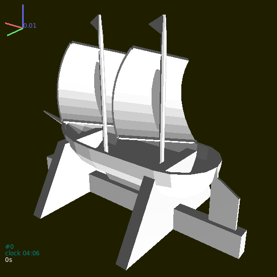
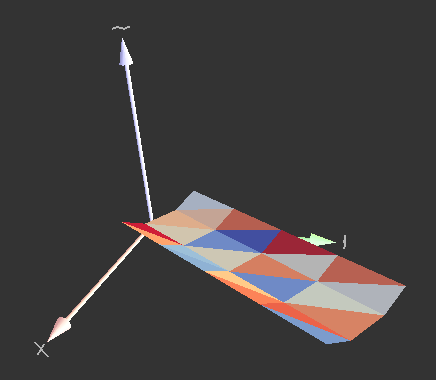

#######
Meshes
#######

.. admonition:: Overview

   This chapter explains particle masks and how to create mesh -- by importing or by paramteric construction.

STL import
===========

`STL (STereoLitography) file format <http://en.wikipedia.org/wiki/STL_%28file_format%29>`__ is an interchange format for triangulated sorfaces in 3d. It is used as a possible export format in many CAD systems. There is a single function for their import, :obj:`woo.utils.importSTL <_utils2.importSTL>` which return list of facet particles, which can be added to the simulation instantly::

   S.dem.par.add(woo.utils.importSTL('your-model.stl'),mat=woo.utils.defaultMaterial())

   Mesh imported from the STL file.

The :obj:`woo.utils.importSTL <_utils2.importSTL>` function has options for scaling, shifting, rotating and assigning colors -- check its documentation for details.

Parametric surfaces
====================

`GNU Triangulated Surface library <http://gts.sourceforce.net>`__ is a library for constructing and manipulating triangulated surfaces. There are a few convenience functions in Woo for converting lists of points into a GTS surface, which can be again converted to list of facets easily, and added to the simulation.

For example, let's create V-shaped conveyor bed with flad bottom. Let's work in local coordinates first, so that :math:`x`-axis is the conveyor axis, :math:`y` is horizontal and :math:`z` is vertical. The dimensions of the bed will be:

* ``botWd``, flat bottom width
* ``sideWd``, elevated side width
* ``sideHt``, elevated side height

The bed will start at :math:`x=0` and will go up to :math:`x=x_1` (``x1``) with ``xDiv`` segments:

.. ipython::

   @suppress
   Woo [1]: S=Scene(fields=[DemField()])

   # set parameters
   Woo [1]: botWd=.3; sideWd=.2; sideHt=.1; x1=2; xDiv=5

   Woo [1]: import numpy

   # x points where polylines will be defined
   Woo [1]: xx=numpy.linspace(0,x1,num=xDiv)

   Woo [1]: print xx

   # for each x, create the polyline with 4 points
   Woo [1]: pts=[[(x,-.5*botWd-sideWd,sideHt),(x,-.5*botWd,0),(x,.5*botWd,0),(x,.5*botWd+sideWd,sideHt)] for x in xx]

   Woo [1]: print pts

   # convert list of polylines to a gts surface (all must have the same number of points)
   Woo [1]: surf=woo.pack.sweptPolylines2gtsSurface(pts)

   Woo [1]: print surf

   # convert surface to facets and add them to the scene
   Woo [1]: S.dem.par.add(woo.pack.gtsSurface2Facets(surf))

If one wants to convert from local to global coordinates, define local coordinates via :obj:`~woo.core.Node` and pass it as the ``localCoords`` parameter to :obj:`woo.pack.sweptPolylines2gtsSurface`:

.. ipython::

   @suppress
   Woo [1]: import math

   Woo [1]: node=Node(pos=(.2,.2,.2),ori=((0,0,1),math.pi/3.))

   Woo [1]: surf=woo.pack.sweptPolylines2gtsSurface(pts,localCoords=node)

or use the node object manually to convert all points:

.. ipython::

   Woo [1]: pts=[[node.loc2glob(p) for p in pp] for pp in pts]

   Woo [1]: surf=woo.pack.sweptPolylines2gtsSurface(pts)

Behind the scenes, :obj:`~woo.core.Node.loc2glob` does nothing else than transforming the local point :math:`p'` using the local origin position :math:`O` and orientation :math:`q` as

.. math:: p=q(p'+O)q^*

or, in Python, ``n.ori*(p+n.pos)``.

.. note:: Quaternions are constructed from the `Axis-angle <http://en.wikipedia.org/wiki/Axis_angle>`__ representation of rotations; angles are always given in radians. Thus e.g. ``Quaternion((0,0,1),math.pi/3.)`` rotates around the :math:`z`-axis by :math:`\frac{\pi}{3}\equiv60°`.

In summary, the conveyor code looks like this, in a compact way:

.. literalinclude:: mesh-bed.py

   Conveyor bed mesh created parametrically by the script above.

.. warning:: Do **not** call :obj:`woo.dem.DemField.collectNodes` once a mesh is added to :obj:`S.dem.par <woo.dem.DemField.particles>`. All nodes would be made subject to motion integration, which is not something you want for static meshes!

.. todo:: Think about ways how to make :obj:`woo.dem.DemField.collectNodes` smarter.

Note on particle masks
=======================

:obj:`Particle.mask <woo.dem.Particle.mask>` is a `bit array <http://en.wikipedia.org/wiki/Bit_array>`__ which determines which particles may have contacts with other particles. Mask is a regular (integer) number in the memory, but is interpreted as individual bits, for example like this::

    0000 0010     = 2 in decimal
    0000 0011     = 3 in decimal
    0000 0110     = 6 in decimal

Binary numbers can be written in python directly, e.g. ``0b0010`` would be the first bit array, equal to ``2`` in decimal.

There are two basic rules:

1. Particles collide only if they have a common bit (that is, if their `bitwise AND <http://en.wikipedia.org/wiki/Bitwise_operation#AND>`__ is nonzero: ``maskA & maskB !=0``).

2. If a common bit is contained in :obj:`DemField.loneMask <woo.dem.DemField.loneMask>`, the particles will not collide. This rule is to avoid collisions of particles where it is meaningless, such as facets in a mesh between themselves. With meshes, the number of spurious "contacts" can be **very high** (thousands) slowing down the simulation unnecessarily.

Mask bits can be further used for marking particles (e.g. with :obj:`~woo.dem.BoxDeleter`, when :obj:`~woo.dem.BoxDeleter.markMask` is set) in arbitrary ways.

**Default values** of mask are different for different particles:

1. Particles which usually move (:obj:`~woo.dem.Sphere`, :obj:`~woo.dem.Ellipsoid`, :obj:`~woo.dem.Capsule`) have the mask set to ``0b0101`` by default (when created using the :obj:`Sphere.make <woo.dem.Sphere.make>` etc functions). This is also the default value for :obj:`ParticleFactory.mask <woo.dem.ParticleFactory.mask>` (particles created during the simulation; treated later)

2. Particles usually acting as the boundary (:obj:`~woo.dem.Facet`, :obj:`~woo.dem.InfCylinder`, :obj:`~woo.dem.Wall`) set the mask to ``0b0011`` by default.

3. :obj:`DemField.loneMask <woo.dem.DemField.loneMask>` default to ``0b0010``.

4. :obj:`BoxDeleter.mask <woo.dem.BoxDeleter.mask>` defaults to ``0b0100`` (delting particles is treated in detail later).

This means that

1. any contacts between boundary particles (:obj:`~woo.dem.Facet` + :obj:`~woo.dem.Facet` and such) are avoided, but that boundary will still interact with particles which usually move;

2. deleters will by default only delete particles which usually move (since they contain the ``0b0100`` bit), but not boundary particles.

If the default behavior is not sufficiently flexible for your setup, it can be always tuned by hand.
