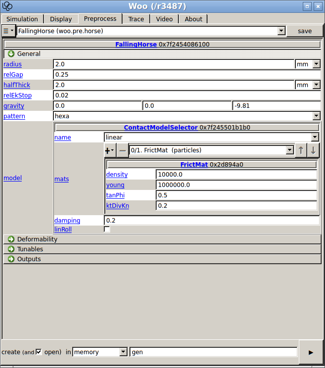

##############
Preprocessors
##############
.. admonition:: Overview

	This chapter explains preprocessors: how to use them, set their parameters, load and save them.

In the :ref:`tutorial-basic` chapter, it was explained how to write a simple simulation in a script. There is an easier way to create parametrized pre-defined simulation: :obj:`preprocessors <woo.core.Preprocessor>`. All classes deriving from :obj:`woo.core.Preprocessor` are presented in the :guilabel:`Preprocess` tab in the controller:

   Preprocessor of the falling horse selected in the controller.

When the :guilabel:`▶` is clicked, a new scene object is created and assigned to ``woo.master.scene``; each preprocessor has different parameters which are used when constructing the scene. What is happening behind the scenes with :guilabel:`▶`? When the preprocessor is called (using ``()`` on the instance), it returns the constructed scene.

This can be done in the command line as well:

.. ipython::

   # create the instance with default parameters
   Woo [1]: horse1=woo.pre.horse.FallingHorse()  

   # create instance and set parameters in the constructor
   Woo [1]: horse2=woo.pre.horse.FallingHorse(gravity=(0,0,-20)) 

   Woo [1]: horse1.gravity, horse2.gravity

   # calling the preprocessor returns a Scene object
   Woo [1]: horse2() 

   # set the current scene by assigning to woo.master.scene
   Woo [1]: woo.master.scene=horse2()

   # let's see what's inside
   Woo [1]: S=woo.master.scene    # avoid lot of typing

   # the FallingHorse.gravity parameter was passed to DemField.gravity
   Woo [1]: S.dem.gravity

Preprocessors can be, just like any other :obj:`objects <woo.core.Object>`, dumped to file, and reloaded. Clicking the :guilabel:`save` pops up a dialogue; file format is chosen by extension (see :ref:`serializationFormats`). A preprocessor can be loaded by using :menuselection:`☰ --> Load`.

The same can be done from a script or the command line:

.. ipython::

   Woo [1]: horse=woo.pre.horse.FallingHorse(gravity=(0,0,-20))

   # dump to file
   Woo [1]: horse.dump('horse.preprocessor',format='expr') 

   # load again: class must be given (for checking what is being loaded)
   # we can also use woo.core.Object
   Woo [1]: woo.core.Object.load('horse.preprocessor')

   # dump to string, just to see
   Woo [1]: print(horse.dumps(format='expr'))

Saved preprocessors (and scenes) can be given as argument in the shell (instead of a script); the preprocessor will be run and assigned to ``woo.master.scene``, and the simulation starts right away::

   $ woo horse.preprocessor
   Welcome to Woo /r3487
   Using preprocessor horse.preprocessor
   [[ ^L clears screen, ^U kills line. F12 controller, F11 3d view, F10 both, F9 generator, F8 plot. ]]

If you don't want to run the simulation automatically, say::

   woo --paused horse.preprocessor

Simple expressions can be used this way, too; this is mostly useful for debugging::

   woo -e 'woo.pre.horse.FallingHorse(gravity=(0,0,-20))'
