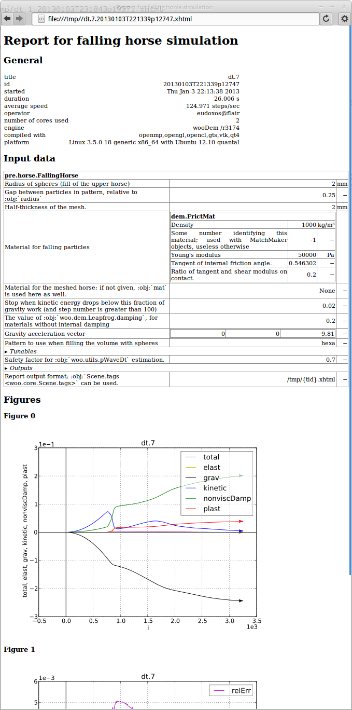

.. _Postprocessing:

***************
Postprocessing
***************

.. _Report:

Report
=======

Every simulation (not just in batch) may generate report which summarizes its inputs and outputs in a human-readable form; it is usually in the XHTML format. There is one report for each simulation.

.. _user-manual-postprocess-vtk-export:

VTK Export
===========

Woo exports python script for Paraview which serves to set the visualization pipeline so that important features of DEM are shown. This includes particles, force networks, transparent meshes and movies. This topic is covered in :ref:`vis-paraview`.

Results database
=================

Finished jobs may write some resulting data to results database in the lightweight `SQLite <http://www.sqlite.org>`_ format. Saved data include batch information, when was the simulation running, plot information, preprocessor parameters and plot data series.

When running in batch, the database is usually named as the parameter table, only with the :file:`results` suffix -- in the `batch example <batch_example>`_, it is :file:`dt.results`. Standalone simulations use preprocessor-defined name, :obj:`FallingHorse <woo.pre.horse.FallingHorse>` uses ``horse.results``.

.. note:: The database file is never deleted, only appended to. Running the same batch several times will therefore leave results of old batches intact.

`SQLite <http://www.sqlite.org>`_ databases can be accessed from virtually any programming language. Contained data are serialized using the neutral `JSON <http://en.wikipedia.org/wiki/Json>`_ representation, so that it can be processed with any language (Python, JavaScript, Matlab, …). Working with the database directly is an advanced topic not covered in this brief introduction. The easiest way is to use XLS dump of the database exaplined in the next section.

XLS dump
----------

The database file is (usually) converted to a ``xls`` file after every write (:file:`dt.xls` in the `batch example <batch_example>`_). It contains most data in the database, and is suitable for human post-processing, such as creating ad-hoc figures or aggregating results in a non-automatic manner.

The first worksheet contains each simulation in one column:

============================================  =============================================  ============================================  ================================================
title                                         dt.05                                          dt.1                                          dt.2
batchtable                                    dt.xls                                         dt.xls                                        dt.xls
batchTableLine                                6                                              5                                             4
finished                                      2013-01-03  23:21:55.011794                    2013-01-03  23:21:34.595636                   2013-01-03  23:20:35.838987
sceneId                                       20130103T231904p19387                          20130103T231843p19371                         20130103T231837p19356
duration                                      171                                            171                                           118
formatNumber                                  3                                              3                                             3
misc.report                                   file:///tmp/dt.05.20130103T231904p19387.xhtml  file:///tmp/dt.1.20130103T231843p19371.xhtml  file:///tmp/dt.2.20130103T231837p19356.xhtml
misc.simulationName                           horse                                          horse                                         horse
plots.t                                       relErr                                         relErr                                        relErr
plots.i.0                                     total                                          total                                         total
plots.i.1                                     S.energy.keys()                                S.energy.keys()                               S.energy.keys()
pre.__class__                                 woo.pre.horse.FallingHorse                     woo.pre.horse.FallingHorse                    woo.pre.horse.FallingHorse
pre.damping                                   0.2                                            0.2                                           0.2
pre.gravity.0                                 0.0                                            0.0                                           0.0
pre.gravity.1                                 0.0                                            0.0                                           0.0
pre.gravity.2                                 -9.81                                          -9.81                                         -9.81
pre.halfThick                                 0.002                                          0.002                                         0.002
pre.mat.__class__                             woo.dem.FrictMat                               woo.dem.FrictMat                              woo.dem.FrictMat
pre.mat.density                               1000.0                                         1000.0                                        1000.0
pre.mat.id                                    -1                                             -1                                            -1
pre.mat.ktDivKn                               0.2                                            0.2                                           0.2
pre.mat.tanPhi                                0.546302489844                                 0.546302489844                                0.546302489844
pre.mat.young                                 50000.0                                        50000.0                                       50000.0
pre.meshMat                                   None                                           None                                          None
pre.pWaveSafety                               0.05                                           0.1                                           0.2
pre.pattern                                   hexa                                           hexa                                          hexa
pre.radius                                    0.002                                          0.002                                         0.002
pre.relEkStop                                 0.02                                           0.02                                          0.02
pre.relGap                                    0.25                                           0.25                                          0.25
pre.reportFmt                                 /tmp/{tid}.xhtml                               /tmp/{tid}.xhtml                              /tmp/{tid}.xhtml
============================================  =============================================  ============================================  ================================================

Other worksheets contain number series for each single simulation; worksheets are named using ``title`` and ``sceneId`` (e.g. ``dt.7_20130103T231904p19387``)

====== ======================= ==== ====================== ====================== ====== ======= ============= ======================
elast  grav                    i    kinetic                nonviscDamp            plast  relErr  t             total
====== ======================= ==== ====================== ====================== ====== ======= ============= ======================
NaN    NaN                     NaN  NaN                    NaN                    NaN    NaN     NaN           NaN
NaN    0                       0    0                      NaN                    NaN    0       0             0
NaN    -2.42618457156355E-005  10   1.94633917852084E-005  4.85206822100937E-006  NaN    0       0.0025455844  5.39152126996832E-008
NaN    -0.0001024389           20   0.000082005            2.04874799044186E-005  NaN    0       0.0050911688  5.39152127070668E-008
NaN    -0.0002345312           30   0.0001876789           4.6905934128109E-005   NaN    0       0.0076367532  5.39152127214935E-008
NaN    -0.0004205387           40   0.0003364848           8.41074308920784E-005  NaN    0       0.0101823376  5.39152127212767E-008
NaN    -0.0006604614           50   0.000528423            0.000132092            NaN    0       0.0127279221  5.39152126490417E-008
NaN    -0.0009542993           60   0.0007634933           0.0001908596           NaN    0       0.0152735065  5.39152126933856E-008
 ⋮         ⋮                    ⋮           ⋮                     ⋮                ⋮     ⋮            ⋮           ⋮ 
====== ======================= ==== ====================== ====================== ====== ======= ============= ======================

Aggregate results
------------------

Simulations may define their own routines for aggregating reults from multiple simulations in an arbitrary manner. Those routines are called (via ``postHooks`` argument to :obj:`woo.batch.writeResults`) after every write to the databse -- that way, synchronization of the aggregate data is assured.

Usually, they can produce aggregate figure for the whole batch, as in the horse example:

.. image:: fig/batch-aggregate.*

