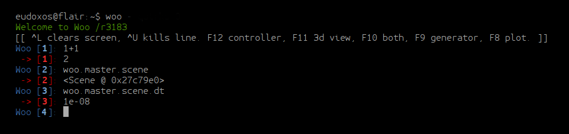
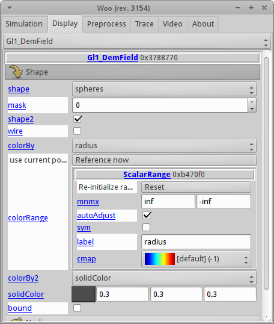
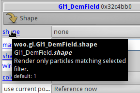
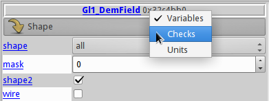
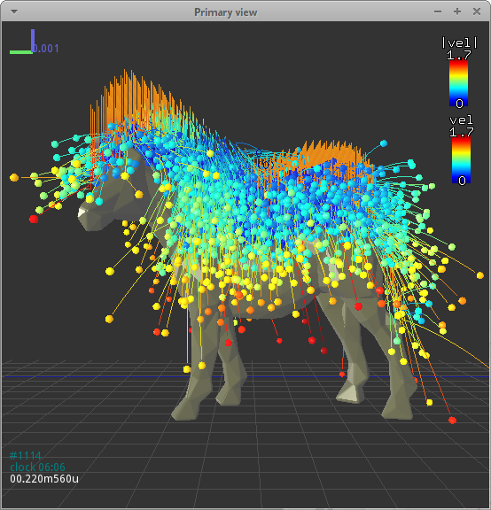
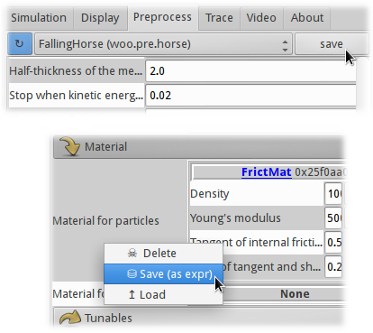

.. _Running_Woo:

************
Running Woo
************

Command-line options
=====================

Woo is primarily a computation program, with only optional graphical user-interface. To run woo, type ``woo`` in the terminal (use ``wwoo`` under Windows). A number of options can be specified, given using UNIX convention of ``--long-option`` or ``-s`` (short option). A help on all available options is obtained with ``woo -h``::

    usage: woo [-h] [--version] [-j THREADS] [--cores CORES] [--cl-dev CLDEV] [-n]
               [-D] [--quirks QUIRKS] [--flavor FLAVOR] [-c COMMANDS] [-e EXPR]
               [--paused] [--nice NICE] [-x] [-v] [-R] [--test] [--no-gdb]
               [--in-gdb] [--in-pdb] [--in-valgrind]

Options important for everyday use are the following ones:

``-j THREADS``
    Number of CPU cores to use for computation. Woo is parallelized using `OpenMP <http://www.openmp.org>`_, and runs on 4 cores by default (or less, if the machine has less than 4). Depending on hardware and the nature of simulation, reasonable value is usually around `-j4`. Woo must have been compiled with the ``openmp`` feature for this option to have any effect.
``-e``
	Evaluate given expression (should yield a :obj:`Scene <woo.core.Scene>` or a :obj:`Preprocessor <woo.core.Preprocessor>`)
``-n``
    Run without graphical interface.
``-x``
    End once the simulation (or script) finishes.
``--paused``
    When loading a simulation from the command line (below), don't have it run immediately.
``-R``
	Recompile Woo before running. Useful during development when sources are modified.
``-RR``
	Update sources from the repository, recompile and run.

Woo takes an additional argument (existing file) coming after options. It can be

#. ``*.py``: python script which will be interpreted by Woo.
#. Saved simulation (in any :ref:`supported format <serializationFormats>`), which will be loaded and run by Woo.
#. Preprocessor, which will be run to create a new simulation, which will be run by Woo.

Once Woo starts, it shows an embedded command-prompt based on `IPython <http://www.ipython.org>`_. It can be used as general-purpose python console and to inspect and modify simulations:

..
	.. ipython::
	    Woo [1]: 1+1
		 Woo [1]: woo.master.scene.dt

To get started with scripting Woo, you should get familiar with Python, for instance using `Python tutorial <http://docs.python.org/2/tutorial/>`_.

Import as python module
========================

Woo can be used in python scripts. You only have to say ``import woo`` and everything should just work. Parameters which cannot be changed once ``woo`` is imported can be set via the :obj:`wooMain.options` object:

.. code-block:: python

    import wooMain
    wooMain.options.ompThreads=4
    wooMain.options.debug=True
    import woo    # initializes OpenMP to 4 threads, and uses the debug build of woo

Graphical interface
===================

Graphical interface is entirely optional in Woo, simulations can run without it (with the `-n` switch, when no `$DISPLAY` is available, in batch, or if compiled without the ``qt4`` feature).

Controller
----------
The main Woo window, called :obj:`controller <woo.qt.ControllerClass>`, is brought up automatically at startup if a simulation/script is given on the command-line (under Windows, the controller is always shown at startup). The controller can be manually brought up by pressing ``F12`` in the terminal, or by typing ``woo.qt.Controller()``. The window (when the first, *Simulation* tab, is active) looks like this:

.. image:: fig/controller-simulation.*

It is divided in several blocks --

A. Time display (simulation time, clock time, step number, timestep)
B. Loading/saving simulation, file where the simulation was last saved
C. Running controls:
	* start/stop
	* advance by one timestep (or multiple steps, or substep)
	* reload from last saved file
D. Display controls (toggle)
	* 3d (OpenGL) window
	* 2d plot window
	* Inspector
E. Area for simulation-specific controls, if defined (:obj:`woo.core.Scene.uiBuild`)

The interface can display structured objects -- for example, unde :menuselection:`Controller --> Display` we see something like this:

Blue object/attribute labels are always *active*:

* *left-click* opens online documentation for that particular class/attribute.
* *middle-click* will copy *path* to that object to the clipboard, which can be then pasted into python.
* each attribute has tooltip showing full documentation for that attribute; just hover over the label.

For the object, attributes can be displayed either as variable names, or as their documentation, units can be enabled/disabled, and per-attribute checkboxes can be added for easy input-checking (when all values must be set):

.. _user-manual-3d-rendering:

3d rendering
------------

3d view
^^^^^^^^

The 3d windows is opened by clicking the "3D" button in the **D** part of the controller.

It is navigated with mouse similar to other 3d software:

* *left drag* rotates
* *right drag* moves
* *middle drag* (wheel) zooms
* *double left-click* sets view angle to the closes multiple of 45°
* :kbd:`Alt` + *left-click* selects object (and shows distance to previous selection)

Many keyboard shortcuts are defined of which the most important ones are:

* :kbd:`h` shows help;
* :kbd:`t` toggles perspective/orthographic camera;
* :kbd:`c` centers the view around whole scene;
* :kbd:`Alt-c` centers the view intelligently around that part of the scene where most particles are;
* :kbd:`a` toggles display of axes;
* :kbd:`g` displays axes grids (cycles between all possible combinations);
* :kbd:`x`, :kbd:`X`, :kbd:`y`, :kbd:`Y`, :kbd:`z`, :kbd:`Z`: make selected axes point upwars and align the other two, i.e. show respectively the ``zx``, ``yx``, ``xy``, ``zy``, ``yz``, ``xz`` plane;
* :kbd:`s` toggles displacement/rotations scaling (see :obj:`woo.gl.Renderer.scaleOn`);
* :kbd:`d` selects which time information is displayed;
* :kbd:`Ctrl-c` copies the view to clipboard, as raster image (can be pasted to documents/graphics editors).

Colorscales can be manipulated using mouse:

* *wheel* changes size
* *right-draw* moves, and toggles portrait/landscape when touching the edge
* *left-click* resets the range an sets to auto-adjust

A movie from the 3d view can be made by checking the :menuselection:`Controller --> Video --> Take snapshots` first, and, when sufficient number of snapshots will have been save, clicking :menuselection:`Controller --> Video --> Make video`.

Display control
^^^^^^^^^^^^^^^^^

The *Display* tab of the controller configures the 3D display. Woo dispatches OpenGL display of all objects to objects (always called ``Gl1_*``) responsible for actual drawing, which is also how this dialogue is organized.

:obj:`Renderer <woo.gl.Renderer>` configures global view properties -- initial orientation, displacement scaling, lighting, clipping, and which general items are displayed.

:obj:`Gl1_DemField <woo.dem.Gl1_DemField>` (shown on the image) is reponsible for displaying contents of DEM simulations (:obj:`woo.dem.DemField`) -- particles, contacts between particles and so on. For instance, particles corresponding to the :obj:`shape <woo.gl.Gl1_DemField.shape>` attribute are colored using the method specified with :obj:`colorBy <woo.gl.Gl1_DemField.colorBy>`. Other particles (not matching :obj:`shape <woo.gl.Gl1_DemField.shape>`, or not able to be colored using :obj:`colorBy <woo.gl.Gl1_DemField.colorBy>`, e.g. non-spherical particle by radius) are colored using :obj:`colorBy2 <woo.gl.Gl1_DemField.colorBy2>`.

Display of each particle's :obj:`shape <woo.dem.Shape>` is dispatched to :obj:`Gl1_* <woo.gl.GlShapeFunctor>` objects (e.g. :obj:`woo.gl.Gl1_Sphere`, :obj:`woo.gl.Gl1_Facet`, …), which control shape-specific options, such as display quality.

.. _preprocessor_gui:

Preprocessor
------------

Preprocessors can be set and run from the *Preprocess* tab, which can be opened directly from the terminal with ``F9`` (Linux-only).

.. image:: fig/controller-preprocessor.*

In the top selection, all available preprocessors are listed. Preprocessor can be modified, loaded and saved. Once you have set all parameters, the *play* button bottom right will create new simulation and switch to the *Simulation* tab automatically.

Unit specifications are only representation. Technically is Woo unit-agnostic, practically, `SI units <http://en.wikipedia.org/wiki/Si_units>`_ are used everywhere. See :obj:`woo._units` for details.

The preprocessor can be saved for later use; it is saved, by default, as python expression. which is human-readable and easily editable::

	##woo-expression##
	#: import woo.pre.horse,woo.dem
	woo.pre.horse.FallingHorse(
		radius=0.002,
		relGap=0.25,
		halfThick=0.002,
		relEkStop=0.02,
		damping=0.2,
		gravity=(0.0, 0.0, -9.81),
		pattern='hexa',
		mat=woo.dem.FrictMat(density=1000.0, id=-1, young=50000.0, tanPhi=0.5463024898437905, ktDivKn=0.2),
		meshMat=None,
		pWaveSafety=0.7,
		reportFmt='/tmp/{tid}.xhtml',
		vtkStep=40,
		vtkPrefix='/tmp/{tid}-'
	)

.. _FileFormats:

Saving and loading things
=========================

Save
----

Simulation, or any piece of it, can be saved and loaded from/to file or memory buffer. For instance, a preprocessor object above might be saved in various ways:

.. code-block:: python

   horse=woo.pre.horse.FallingHorse()
   horse.damping=0.4

   horse.saveTmp()                           # save to the default memory buffer
   horse.saveTmp('something')                # save to a named memory buffer
   horse.dump('/tmp/somefile.json')          # save to file, guess format (JSON) to use from filename
   horse.dump('/tmp/somefile.expr.gz')       # save to file, guess format (gzipped python expression) from filename
   horse.dump('/tmp/somefile',format='json') # save to file, using the json format
   dumpString=horse.dumps(format='expr')     # dump to a string variable

Objects can also be saved (and loaded) from the graphical user interface:

Load
----

Loading is more involved due to type hierarchy; after loading, the object is checked to be instance of whichever class' method was called. File format is detected automatically when loading.

.. code-block:: python

   horse=woo.core.Object.load('/tmp/somefile.xml')            # FallingHorse is an Object, this is OK
   horse=woo.pre.horse.FallingHorse.load('/tmp/somefile.xml') # FallingHorse is a FallingHorse, this is OK
   horse=woo.dem.FrictMat.load('/tmp/somefile.xml')           # FallingHorse is not a FrictMat, raises exception
   horse=woo.core.Object.loads(dumpString)                    # load from string variable
   horse=woo.core.Object.loadTmp()                            # load from the default memory buffer
   horse=woo.core.Object.loadTmp('something')                 # load from a named memory buffer

.. _serializationFormats:

Formats
--------

There is a number of format Woo can save into and load from.

Complete formats
    are *computer-readable* formats designed to store as much useful information as possible, so that saved object can be loaded into identical state. They are rather *efficient* in terms of saving/loading speed.

    Their principal limitation is that they are not compatible between different versions (or even builds) of Woo, since they rely on memory layout being identical.

    Another limitation is that the c++/python boundary is not handled: python object deriving from a c++ object will only be saved as instance of the leaf class in c++; we attempt to detect this condition, but it should not be relied on.

Dump formats
    store only some amount of information. Most of them are *human-readable* and *human-modifiable*, most of them are also *computer-readable*, but without the claim of reconstructing the entire object. They should be used form small objects (such as preprocessors, materials and so on), being less efficient than complete formats.

    They are not guaranteed to be compatible between versions either, but they do remain compatible as long as the same attributes of a particular object are defined. They are also safe to use with c++ objects extended in python.

.. note::

   File extension is only important when saving an object and format is not specified -- auto-detection will be attempted based on file extension.

   Extension is disregarded when loading an object, the format is always detected from the actual contents of the file.

The following table summarizes available formats:

========= ======== =============== ==================================================
Format    Type     Extension       Description                                       
========= ======== =============== ==================================================
binary    complete -, ``.bin``     Boost::serialization memory dump. This            
                   (compressed:    is the most efficient format in terms of          
                   ``.gz``,        speed. Compressed with gzip (by appending ``.gz``)
                   ``.bz2``)       is quite storage-efficient.

                                   This is the default format for saving entire
                                   simulations.

expr      dump     ``.expr``       Text which is a valid python expression           
                                   (with some special comments)                      
                                   evaluating to given object. It is extremely       
                                   *human-readable* and *human-writeable*, thus      
                                   recommended for small objects (preprocessors,     
                                   in particular).
                                  
                                   This is the default format for small objects,
                                   such as preprocessors.
                                                                                     
                                   Since special comments may                        
                                   contain *any* python commands, **DO NOT** load    
                                   files unless you know what they contain           
                                   (malicious user could e.g. instruct your computer 
                                   to delete all files in your home directory).      

                                                                                     
XML       complete ``.xml``        Boost::serialization dump written as XML.         
                   (compressed:    To some extent human-readable; efficient for      
                   ``.xml.gz``     speed, inefficient for storage. Best compressed   
                   ``.xml.bz2``)   with bzip2 (append ``.bz2``).

                                   Some builds may not support saving to XML,
                                   depending on compilation options.
                                                                                     
JSON      dump     ``.json``       `JavaScript Object Notation                       
                                   <http://en.wikipedia.org/wiki/JSON>`_ serves      
                                   for excellent inter-language compatibility;       
                                   this format is *human-* and                       
                                   *computer-readable* and *writeable*, but its      
                                   syntax is limited. Use this format to load        
                                   objects in Matlab, JavaScript and similar.        
                                   Can store other objects than just                 
                                   instances of :obj:`woo.core.Object`.              
                                                                                     
pickle    dump     ``.pickle``     Serialization format used extensively in the      
                                   python world. It is only used internally by Woo,  
                                   for some data stored in SQLite database, for      
                                   instance.                                         
                                                                                     
                                   Unlike most other formats, it can store           
                                   other objects than those deriving from            
                                   :obj:`woo.core.Object` and their sequences.       

HTML      dump     ``.html``       Dump object to HTML table; this format is used    
                                   when reports of simulation are generated          
                                   (see e.g. :ref:`Report`). This format is *write-only*.  
                                   It is the *only* format showing preferred         
                                   unit for each quantity.                           
========= ======== =============== ==================================================

Format examples
^^^^^^^^^^^^^^^^^

To get a taste what those files look like, here are fragments of them.

Binary represented as hex dump::

		00000000  16 00 00 00 00 00 00 00  73 65 72 69 61 6c 69 7a  |........serializ|
		00000010  61 74 69 6f 6e 3a 3a 61  72 63 68 69 76 65 09 00  |ation::archive..|
		00000020  04 08 04 08 01 00 00 00  00 01 00 00 00 02 00 05  |................|
		00000030  00 00 00 00 00 00 00 53  63 65 6e 65 01 00 00 00  |.......Scene....|
		00000040  00 00 00 00 00 01 00 00  00 00 01 00 00 00 3a 8c  |..............:.|
		00000050  30 e2 8e 79 45 3e 00 00  00 00 00 00 00 00 00 ff  |0..yE>..........|
		00000060  ff ff ff 00 00 00 00 00  00 00 00 00 00 00 00 00  |................|
		00000070  00 00 00 00 00 00 00 00  00 00 ff ff ff ff ff ff  |................|
		00000080  ff ff 00 00 00 00 00 00  00 00 00 00 00 00 00 00  |................|
		00000090  00 00 f0 bf 00 00 00 00  00 00 f0 bf 00 00 00 00  |................|
		000000a0  00 00 f0 bf 00 00 00 00  00 00 f0 3f 00 00 00 00  |...........?....|
		000000b0  00 00 f0 3f 00 00 00 00  00 00 f0 3f 01 00 00 00  |...?.......?....|
		000000c0  00 00 06 00 00 00 00 00  00 00 00 00 00 00 00 00  |................|
		000000d0  00 00 00 02 00 00 00 00  00 00 00 69 64 14 00 00  |...........id...|
		000000e0  00 00 00 00 00 32 30 31  33 30 32 31 31 54 31 32  |.....20130211T12|
		000000f0  32 30 30 31 70 39 34 32  38 03 00 00 00 00 00 00  |2001p9428.......|
		00000100  00 69 64 74 14 00 00 00  00 00 00 00 32 30 31 33  |.idt........2013|
		00000110  30 32 31 31 54 31 32 32  30 30 31 70 39 34 32 38  |0211T122001p9428|
		00000120  07 00 00 00 00 00 00 00  69 73 6f 54 69 6d 65 0f  |........isoTime.|
		00000130  00 00 00 00 00 00 00 32  30 31 33 30 32 31 31 54  |.......20130211T|
		00000140  31 32 32 30 30 31 03 00  00 00 00 00 00 00 74 69  |122001........ti|
		00000150  64 14 00 00 00 00 00 00  00 32 30 31 33 30 32 31  |d........2013021|
		00000160  31 54 31 32 32 30 30 31  70 39 34 32 38 05 00 00  |1T122001p9428...|
		00000170  00 00 00 00 00 74 69 74  6c 65 00 00 00 00 00 00  |.....title......|
		00000180  00 00 04 00 00 00 00 00  00 00 75 73 65 72 0d 00  |..........user..|
		00000190  00 00 00 00 00 00 65 75  64 6f 78 6f 73 40 66 6c  |......eudoxos@fl|
		000001a0  61 69 72 00 00 00 00 00  00 00 00 00 00 00 00 00  |air.............|

XML includes attribute names and all data are stored in ASCII:

.. code-block:: xml

		<?xml version="1.0" encoding="UTF-8" standalone="yes" ?>                              
		<!DOCTYPE boost_serialization>
		<boost_serialization signature="serialization::archive" version="9">
		<woo__Object class_id="0" tracking_level="0" version="1">
			 <px class_id="2" class_name="Scene" tracking_level="1" version="0" object_id="_0">
				 <Object class_id="1" tracking_level="1" version="0" object_id="_1"></Object>
				 <dt>1e-08</dt>
				 <step>0</step>
				 <subStepping>0</subStepping>
				 <subStep>-1</subStep>
				 <time>0</time>
				 <stopAtStep>0</stopAtStep>
				 <isPeriodic>0</isPeriodic>
				 <trackEnergy>0</trackEnergy>
				 <clDev class_id="3" tracking_level="0" version="0">
					 <x>-1</x>
					 <y>-1</y>
				 </clDev>
				 <boxHint class_id="4" tracking_level="0" version="0">
					 <min class_id="5" tracking_level="0" version="0">
						 <x>-1</x>
						 <y>-1</y>
						 <z>-1</z>
					 </min>
					 <max>
						 <x>1</x>
						 <y>1</y>
						 <z>1</z>
					 </max>
				 </boxHint>
		…

JSON is rather readable, but also quite verbose (note the special ``__class__`` items, which are added so that reconstructing Woo objects is possible):

.. change format to json once pygments support that --

.. code-block:: python
                                                                           
		{
			 "__class__": "woo.pre.horse.FallingHorse", 
			 "damping": 0.2, 
			 "gravity": [
				 0.0, 
				 0.0, 
				 -9.81
			 ], 
			 "halfThick": 0.002, 
			 "mat": {
				 "__class__": "woo.dem.FrictMat", 
				 "density": 1000.0, 
				 "id": -1, 
				 "ktDivKn": 0.2, 
				 "tanPhi": 0.5463024898437905, 
				 "young": 50000.0
			 }, 
			 "meshMat": null, 
			 "pWaveSafety": 0.7, 
			 "pattern": "hexa", 
			 "radius": 0.002, 
			 "relEkStop": 0.02, 
			 "relGap": 0.25, 
			 "reportFmt": "/tmp/{tid}.xhtml", 
			 "vtkPrefix": "/tmp/{tid}-", 
			 "vtkStep": 40
		}

Python expression format is trivial to read, modify and write by human; indentation is not important, the ``#:`` sequence introduces commands which will be executed before evaluating the expression (usually import statements)::
                                                                                                       
		##woo-expression##
		#: import woo.pre.horse,woo.dem
		woo.pre.horse.FallingHorse(
			radius=0.002,
			relGap=0.25,
			halfThick=0.002,
			relEkStop=0.02,
			damping=0.2,
			gravity=(0.0, 0.0, -9.81),
			pattern='hexa',
			mat=woo.dem.FrictMat(density=1000.0, id=-1, young=50000.0, tanPhi=0.5463024898437905, ktDivKn=0.2),
			meshMat=None,
			pWaveSafety=0.7,
			reportFmt='/tmp/{tid}.xhtml',
			vtkStep=40,
			vtkPrefix='/tmp/{tid}-'
		)                                                                                                     
                                                                                                       
Python's pickle format (the ASCII-based one)::

		cwoo.pre.horse
		FallingHorse
		p0
		(tRp1
		  (dp2
		S'mat'
		p3
		cwoo.dem
		FrictMat
		p4
		(tRp5
		(dp6
		S'id'
		p7
		I-1
		sS'ktDivKn'
		p8
		F0.2
		sS'tanPhi'
		p9
		F0.5463024898437905
		…
 
HTML dump is a XHTML-fragment (optionally with head and body tags as shown here):

.. code-block:: xml

		<head>
			<meta http-equiv="content-type" content="text/html;charset=UTF-8" />
		</head>
		<body>
			<table cellpadding="2px" rules="all" frame="box">
				<th colspan="3" align="left"><b>pre.horse.FallingHorse</b></th>
				<tr>
					<td colspan="3"><i>&#9656; General</i></td>
				</tr>
				<tr>
					<td>radius</td>
					<td align="right">2</td>
					<td align="right">mm</td>
				</tr>
				<tr>
					<td>relGap</td>
					<td align="right">0.25</td>
					<td align="right">&#8722;</td>
				</tr>
				<tr>
					<td>halfThick</td>
					<td align="right">2</td>
					<td align="right">mm</td>
				</tr>
				<tr>
					<td>relEkStop</td>
					<td align="right">0.02</td>
					<td align="right">&#8722;</td>
				</tr>
		…
