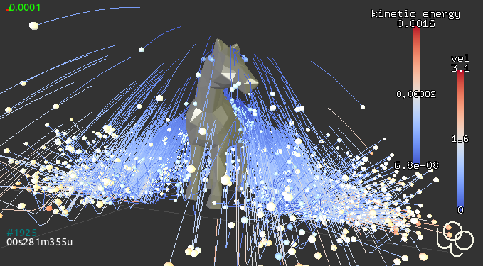
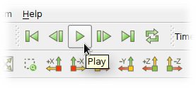

**************
Visualization
**************

.. _vis_opengl:

Integrated 3d view
===================

The 3d view is opened by the "3D" button in the controller, or by calling ``woo.qt.View()``. It is based on OpenGL and rather flexible.

.. image:: fig/controller-3d.png

Mouse can be used to manipulate the camera:

* *left drag* rotates
* *middle drag* (wheel) moves
* *right drag* (wheel) zooms
* *double left-click* sets view angle to the closes multiple of 45°
* :kbd:`Alt` + *left-click* selects object (and shows distance to the previous selection)

Many keyboard shortcuts are defined of which the most important ones are:

* :kbd:`h` shows help;
* :kbd:`t` toggles perspective/orthographic camera type;
* :kbd:`c` centers the view around whole scene; :kbd:`Alt-c` centers the view intelligently around that part of the scene where most particles are;
* :kbd:`q` (as quality) cycles the FPS (frames per second value): 2, 5, 10, 15. :kbd:`Shift-Q` toggles fast display (useful with many particles)
* :kbd:`a` toggles display of axes;
* :kbd:`g` displays axes grids (cycles between all possible combinations; :kbd:`Shift-G` toggles all on/off)
* :kbd:`x`, :kbd:`X`, :kbd:`y`, :kbd:`Y`, :kbd:`z`, :kbd:`Z`: make selected axes point upwars and align the other two, i.e. show respectively the ``zx``, ``yx``, ``xy``, ``zy``, ``yz``, ``xz`` plane;
* :kbd:`s` toggles displacement/rotations scaling (see :obj:`woo.gl.Renderer.scaleOn`); :kbd:`Shift-S` sets reference positions to current ones;
* :kbd:`d` selects which time information is displayed (cycles through all combinations);
* :kbd:`Ctrl-c` copies the view to clipboard, as raster image (can be pasted to documents/graphics editors).

Colorscales can be manipulated using mouse:

* *wheel* changes size
* *right-draw* moves, and toggles portrait/landscape when touching the edge
* *left-click* resets the range an sets to auto-adjust

A movie from the 3d view can be made by checking the :menuselection:`Controller --> Video --> Take snapshots` first, and, when sufficient number of snapshots will have been save, clicking :menuselection:`Controller --> Video --> Make video`.

Display control
^^^^^^^^^^^^^^^^^

The *Display* tab of the controller configures the 3D display. Woo dispatches OpenGL display of all objects to objects (always called ``Gl1_*``) responsible for actual drawing, which is also how this dialogue is organized.

.. image:: fig/controller-display.png

:obj:`Renderer <woo.gl.Renderer>` configures global view properties -- initial orientation, displacement scaling, lighting, clipping, and which general items are displayed. Useful options are :obj:`woo.gl.Renderer.engines>` for showing/hiding engines which render something (typically inlets/outlets) and :obj:`woo.gl.Renderer.ghosts` for repeating particles in periodic boundary conditions.

:obj:`Gl1_DemField <woo.dem.Gl1_DemField>` (shown on the image) is reponsible for displaying contents of DEM simulations (:obj:`woo.dem.DemField`) -- particles, contacts between particles and so on.

Particle coloring
-----------------

When displaying the DEM scene, particles matching :obj:`shape <woo.gl.Gl1_DemField.shape>` attribute are colored using the method specified with :obj:`~woo.gl.Gl1_DemField.colorBy`. Colormapping is controlled via the :obj:`~woo.gl.G1l_DemField.colorRange` object, which is automatically switched based on :obj:`~woo.gl.Gl1_DemField.colorBy`.

Particles not matching :obj:`shape <woo.gl.Gl1_DemField.shape>`, or those which cannot be color-mapped using :obj:`~woo.gl.Gl1_DemField.colorBy` (e.g. non-spherical particle by radius) will fall back to :obj:`~woo.Gl1_DemField.shape2` (which can be turned off) and colored using :obj:`~woo.gl.Gl1_DemField.colorBy2` and :obj:`~woo.gl1.Gl1_DemField.colorScale2`.

Active color-mapping scale will be shown in the 3d view automatically, and can also be manipulated by mouse (resetting via right-click and so on).

Once particle's color is determined, particle's :obj:`shape <woo.dem.Shape>` is dispatched to :obj:`Gl1_* <woo.gl.GlShapeFunctor>` objects (e.g. :obj:`woo.gl.Gl1_Sphere`, :obj:`woo.gl.Gl1_Facet`, …), which control shape-specific options, such as display quality, forcing wire display and so on. Those are again parametrizable from the *Display* tab. These object can also be saved along with the simulation (by stuffing them to :obj:`woo.core.Scene.any`, for instance); they are (currently) static, so loading then will overwrite current values.

Quality
--------

:obj:`woo.gl.Renderer.fast` (toggled via :kbd:`Q` in the 3d view) switches between normal, fast and "unfocused" fast display (when the 3d windows is not focused). Fast display is useful for huge simulations where regular rendering would be demanding on the 3d hardware, and also useless for just seeing what is happening.

Displacement scaling
---------------------

:obj:`woo.gl.Renderer.dispScale` and :obj:`~woo.gl.Renderer.rotScale` allow for scaling displacements and rotations, which is very useful for situations where movements are vey small compared to particle size, thus regular view only reveals static scene. Scaling can be turned on/off via :kbd:`s` from the 3d view, and reference positions are set by pressing :kbd:`Shift-S` (this can be also done from the Display/Renderer tab).

Velocity/forces
----------------

Velocities, forces (or virtually any other glyphs attached to nodes by the user) are shown by setting :obj:`woo.gl.Gl1_DemField.glyph` (under :menuselection:`Display --> Gl1_DemField --> Nodes`). 

	Velocity shown as arrows. The particles are also colored by velocity, therefore there are two colorscaled shown.

Contact network
---------------

:menuselection:`Display --> Gl1_DemField --> Contact nodes` configures how contacts are displayed. By default, contacts are not displayed at all. :obj:`~woo.gl.Gl1_DemField.cNode` bits can show contacts as lines, show contact-local coordinates, or user-attached :obj:`woo.core.NodeVisRep` object.

Contact network, where contacts are shown as cylinder, with radius corresponding to transmitted force, is shown by setting :obj:`~woo.gl.Gl1_DemField.cPhys`. The rest is configured in the respective functor, i.e. under :menuselection:`Display --> Gl1_CPhys`. Coloring can depend on normal or shear force, and radius of cylinders can be set. To better see contact network, it is often useful to hide particles by unsetting :obj:`Gl1_DemField.shape <woo.gl.Gl1_DemField.shape>` and :obj:`Gl1_DemField.shape2 <woo.gl.Gl1_DemField.shape2>`, or, with spherical particles, show them smaller than they really are by using :obj:`woo.gl.Gl1_Sphere.scale`.

   Force chain in cylindrical :obj:`triaxial test <woo.pre.triax.TriaxTest>`, with default settings of :obj:`woo.gl.Gl1_CPhys`.

Particle traces
----------------

The :menuselection:`Trace` tab serves to enable the :obj:`~woo.dem.Tracer` engine, which attaches :obj:`~woo.dem.TraceVisRep` to each node within the :obj:`~woo.dem.DemField` and periodically stores position data, with some attached scalar (velocity, time, etc) which is used for coloring the trace. The trace works either as circular buffer (with zero :obj:~woo.dem.Tracer.compress`), or as fixed-length storage with varying resolution (older data being pruned, the latest having always the highest resolution).

Traces support displacement scaling and periodic boundary conditions. Traces can be restricted to particles of some specific radius (:obj:`~woo.dem.Tracer.rRange`); quasi-random selection can be achieved using the :obj:`~woo.dem.Tracer.modulo`.

This image shows the horse where particles are colored by velocity and traces by kinetic energy:

Movies
-------

Movie can be made from snapshots of the 3d view taken by :obj:`woo.qt.SnapshotEngine`. This engine is usually activated from the control panel in :menuselection:`Video --> Take snapshots`; snapshots are taken using the usual periodicity parameters; video from those snapshots is created when clicking the :menuselection:`Make video` button.

.. _vis-paraview:

Paraview
=========

`Paraview <http://www.paraview.org>`__ is multi-platform data analysis and scientific visualization application. Woo can export two types of data:

* snapshots of particles and contacts for visualization or evolution analysis using :obj:`~woo.dem.VtkExport`; 
* time-averaged and space-averaged data for flow and segregation analysis using :obj:`~woo.dem.FlowAnalysis`;
* particle traces, as collected by :obj:`~woo.dem.Tracer`.

The first two are shown in this movie, created in Paraview from the :obj:`woo.pre.horse.FallingHorse` simulation:

.. youtube:: LB3T6sBdwz0

Paraview data sources
^^^^^^^^^^^^^^^^^^^^^^

:obj:`~woo.dem.VtkExport`
-----------------------------

:obj:`~woo.dem.VtkExport` is a :obj:`periodic engine <woo.core.PeriodicEngine>` which saves particles and contacts in regular intervals; this results in several time-series of data which can be used e.g. to create beautiful movies from Paraview; Paraview visualization capabilities are far more advanced than what the 3d view in Woo offers, which is in contrast more DEM-specific, thus more useful in other situations.

.. ipython::

   Woo [1]: S.engines=S.engines+[
      ...:   VtkExport(
      ...:      # run every 100 steps
      ...:      stepPeriod=100,  
      ...:      # the default is what=VtkExport.all, no need to specify it usually
      ...:      what=VtkExport.spheres|VtkExport.mesh|VtkExport.tri|VtkExport.con 
      ...:      # where will the output go; can use {tags} 
      ...:      out="/tmp/{tid}-"
      ...:   )

Output files can be opened by hand (tedious, but detailed below for reference), or using script which automated creating of the visualization pipeline.

:obj:`~woo.dem.FlowAnalysis`
-----------------------------

:obj:`~woo.dem.FlowAnalysis` is an engine which :obj:`periodically <woo.core.PeriodicEngine>` stores flow data interpolated in a uniform grid. The theory is described in :ref:`user-manual-flow-analysis`. The :obj:`woo.paraviewscript.fromEngines` introduced below recognizes the presence of :obj:`~woo.dem.FlowAnalysis` and puts its data into the visualization pipeline script as well.

:obj:`~woo.dem.Tracer`
-----------------------------

Particle traces, if relevant data are collected with an instance of :obj:`~woo.dem.Tracer`, are also exported by :obj:`woo.paraviewscript.fromEngines` for use in Paraview. Note that trace data can considerably increase dataset size.

Pipeline script
^^^^^^^^^^^^^^^^^

Loading files manually (detailed below) is not very easy. Fortunately, there is a handy command :obj:`woo.paraviewscript.fromEngines` which writes Paraview script including all setup, by scanning engines in the simulation:

.. ipython::

   Woo [1]: import woo.paraviewscript

   # use launch=True to run Paraview right away
   # this writes into temporary file
   Woo [1]: woo.paraviewscript.fromEngines(S,launch=True) 

   # writes into user-defined file
   Woo [1]: woo.paraviewscript.fromEngines(S,out='something.py') 

The script can be then used in 2 ways:

1. As script to be run with Paraview, which will load all necessary files and set the visualization pipeline up::

      paraview --script=something.py

   This can also be achieved from Paraview GUI by going to :menuselection:`Tools --> Python Shell -> Run Script`.

2. As a means to zip all or some (using the ``--slice`` option) data files and the script itself, e.g. for easy transfer or archiving (run with ``--help`` for more help)::

      python something.py --zip --slice=-1:

The script is also used internally when the ``Open in Paraview`` button in the :obj:`~woo.dem.VtkExport` is clicked from the Inspector.

The script creates entries for spherical particles, for flow analysis data, contact networks, triangulated surfaces with opacity and more. The auto-created pipeline can look e.g. like this:

Making movies
^^^^^^^^^^^^^^

Movies are important for cool presentatations. Once the visualization pipeline is set up to your satisfaction, go to :menuselection:`File --> Save Animation`.

Manual pipline setup
^^^^^^^^^^^^^^^^^^^^^

The visualization pipeline can be set up by hand. The following covers how this is done. The user should normally not need to to this, though.

:obj:`~woo.dem.VtkExport` produces files periodically, and every time several files may be created, for example::

    /tmp/20130107T161406p4252-con.1040.vtp
    /tmp/20130107T161406p4252-mesh.1040.vtu
    /tmp/20130107T161406p4252-spheres.1040.vtu

Those can be loaded into Paraview as groups.  Note that the ``/tmp/{tid}-`` (from the example above) was expanded (see :ref:`tutorial-tags`) to ``/tmp/20140620T145830p6238-`` and different endings were appended for different data (``con`` for contacts, ``mesh`` for boundary meshes, ``spheres`` for spherical particles, ``tri`` for triangulated particles). Each ``...`` hides series of step numbers (40, 80, 120, ...) which Paraview loads sequentially.

``-con`` contains contact data, ``-mesh`` mesh data (triangulated surfaces), ``-spheres`` data concerning spherical particles. You can open all datasets at once with Paraview by selecting them with :kbd:`Ctrl`:

Datasets appear in the *Pipeline browser*, but will not be displayed until the :guilabel:`Apply` button is clicked.

Every dataset can be colored, e.g. velocity can be used as coloring scalar by selecting that property:

Datasets can be visualized at different timesteps using the frame control in the Paraview menu:

Spherical particles
--------------------

You notice that spherical particles are rendered as points rather than spheres. In order to see spheres, sphere "glyph" has to be attached to each point, and it will be scaled by the *radius* scalar defined in each point (particle).

Select the ``-spheres`` dataset in the *Pipeline browser*, then add glyph using the |paraview-glyph-icon| icon. In the *Properties* for the glyph, set the following:

* *Glyph type* = Sphere;
* *Radius* = 1 (further scaled by selected scalars to obtain true radius);
* *Scale Mode* = scalar;
* *Set Scale Factor* = 1;
* disable *Mask Points* and *Random Mode*;
* on the top, set *Scalars* = radius.

Since glyphs are rendered over points of the dataset, those can be made invisible by clicking on the eye icon next to the ``-spheres`` dataset in the *Pipeline browser*.

Force Network
--------------

Presenting contacts as cylinders of which radius varies by transmitted force is possible in Paraview.

#. Load and select the ``-con`` dataset.
#. Add the "Point Data to Cell Data" filter.
#. Add the "Tube" filter; in there set:

   #. "Scalar" to ``Fn`` or ``|Ft|`` depending on how you want to scale cylinders;
   #. "Vary Radius" to "By Scalar";
   #. "Radius" to something rather small compared to particle radii;
   #. "Radius Factor" to something big, like 1000; the last two parameters determine how much the radius varies by force.

